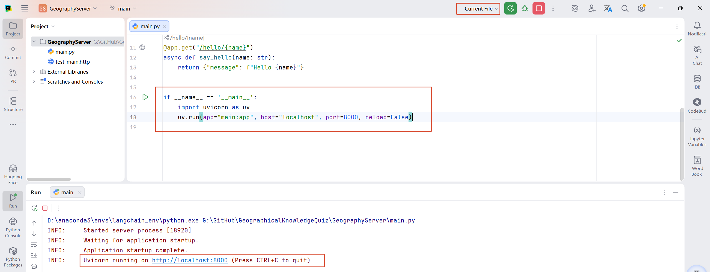
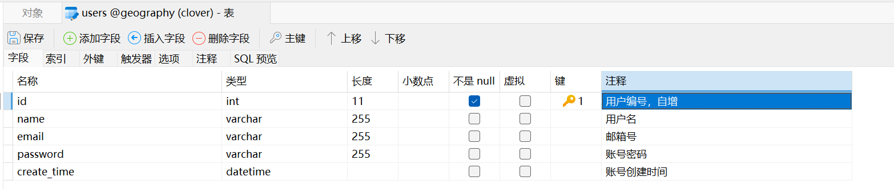
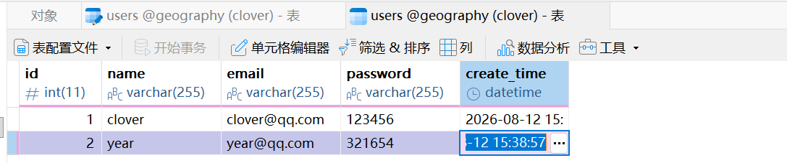
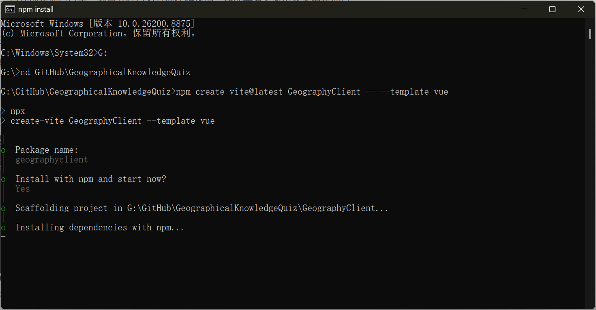
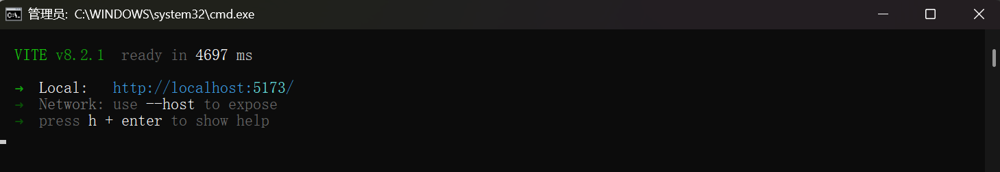
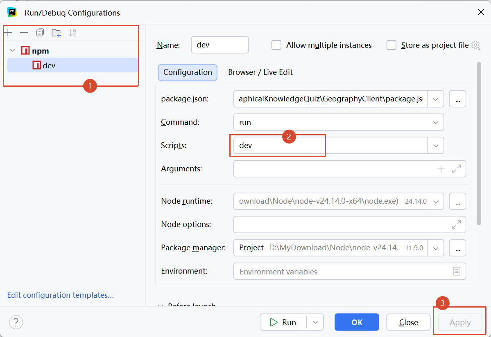
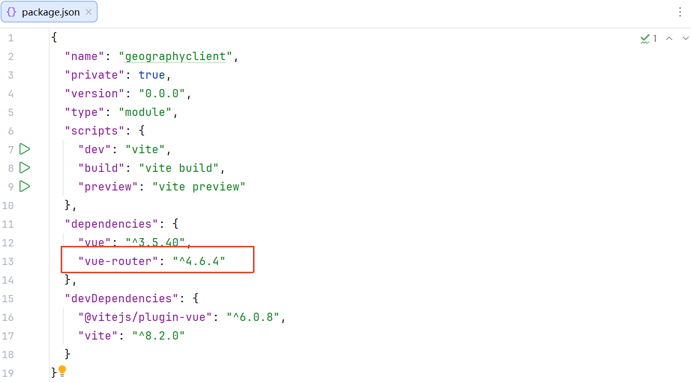
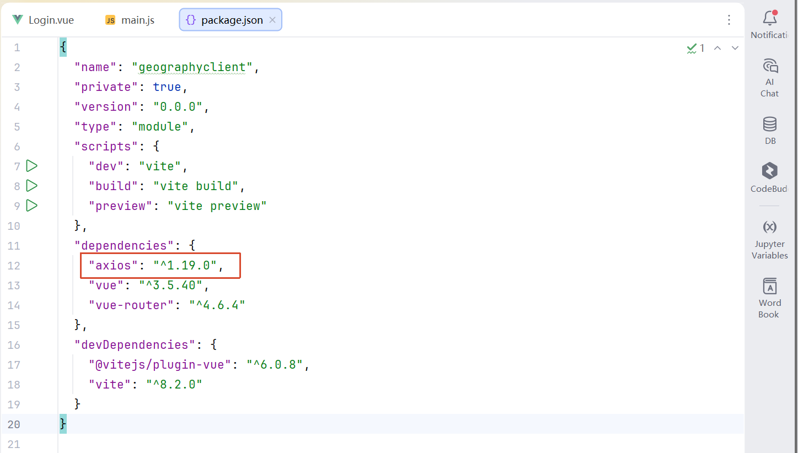

# GeographicalKnowledgeQuiz
关于地理知识的RAG问答系统

# GeographyServer

## （一）配置

### 1. 分包处理

### 2. 启动方式

在`main.py`文件中添加

```python
if __name__ == '__main__':
    import uvicorn as uv
    uv.run(app="main:app", host="localhost", port=8000, reload=False)
```



### 3. 启动和关闭执行

在`main.py`文件中添加并修改：

```python
from contextlib import asynccontextmanager
@asynccontextmanager
async def start_and_stop(app):
    app.state.username = "clover"
    print("启动项目")
    yield
    print("关闭项目")

app = FastAPI(lifespan=start_and_stop)
```

### 4. 跨域配置

用于连接客户端

```python
from fastapi.middleware.cors import CORSMiddleware
app.add_middleware(
    CORSMiddleware,
    allow_origins=["http://localhost:8080"],    # 允许的跨域访问的域名 -- 完整的客户端域名
    allow_credentials=True, # 允许携带cookie
    allow_methods=["*"],    # 允许的跨域访问请求的方法
    allow_headers=["*"],    # 允许的跨域访问请求的头部信息
)
```

## （三）创建数据库

创建用户表：



添加测试用户：




## （四）登陆

### 1. 路由

#### 创建用户子路由 -- `main.py`：

```
# 用户子路由
from users.controller.UsersController import users_router
app.include_router(
    users_router, 
    prefix="/users",
    tags=["users"],
)
```

### 2. 发送邮件

#### 创建发送邮件参数规范格式 -- `CaptchaEmailEntity.py`

```
from pydantic import BaseModel, Field

class CaptchaEmailEntity(BaseModel):
    username: str = Field(..., description="用户名")
    email: str = Field(..., description="邮箱")
    captcha: str = Field(..., description="验证码")
```

#### 创建发送验证码邮件接口 -- `UsersController.py`

```python
from users.entity.CaptchaEmailEntity import CaptchaEmailEntity
from users.service import UsersService

@users_router.post(
    path='/captchaEmail',
    summary='发送验证码邮箱'
)
def captcha_email(captcha_email_entity: CaptchaEmailEntity):
    print(f"接收到用户信息（发送邮件）：{captcha_email_entity}")
    return UsersService.captcha_email(captcha_email_entity)
```

#### 创建数据库工具 -- `MySQLUtil.py`

配置环境变量 -- `.env`：

```
# 数据库相关配置
MYSQL_HOST="localhost"
MYSQL_PORT="3306"
MYSQL_USER="root"
MYSQL_PASSWORD="123456"
MYSQL_DATABASE="geography"
MYSQL_CHARSET="utf8mb4"
```

获取与关闭连接：

获取 -- IP地址、端口号、数据库账户和密码、数据库名称、字符集、以字典的形式返回结果

```python
import pymysql
import os
from dotenv import load_dotenv

load_dotenv()

# 获取连接
def get_mysql_conn():
    return pymysql.connect(
        # IP地址
        host=os.getenv("MYSQL_HOST"),
        # 端口号 -- 类型为 int
        # os.getenv("MYSQL_PORT") -- 类型为 str，需要转换为 int
        port=int(os.getenv("MYSQL_PORT")),
        # 数据库账户
        user=os.getenv("MYSQL_USER"),
        # 数据库账户对应的密码
        password=os.getenv("MYSQL_PASSWORD"),
        # 数据库名称
        database=os.getenv("MYSQL_DATABASE"),
        # 字符集
        charset=os.getenv("MYSQL_CHARSET"),
        # 以 dict 的方式返回查询结果
        cursorclass=pymysql.cursors.DictCursor
    )

# 关闭连接
def close_mysql_conn(cursor,conn):
    cursor.close()
    conn.close()
```

#### 查询数据库 -- `UsersDao.py`

获取需要的数据，辅助验证

```python
from common import MySQLUtil

def check_user(username, email, password):
    # 创建连接对象
    conn = MySQLUtil.get_mysql_conn()
    # 创建游标对象，执行数据库相关操作
    cur = conn.cursor()
    # MySQL操作
    if email:
        sql = "select * from users where email = %s and  password= %s;"
        data = (email, password)
    elif username:
        sql = "select * from users where name = %s and password = %s;"
        data = (username, password)
    else:
        return {
            "code": 500,
            "msg": "邮箱和用户名不能同时为空，必须二选一"
        }
    # 执行操作
    cur.execute(sql, data)
    # 获取结果
    result = cur.fetchone()
    print(f"查询用户信息结果：{result}")
    # 关闭连接
    MySQLUtil.close_mysql_conn(cur, conn)
    return result

if __name__ == '__main__':
    print(check_user("", "clover@qq.com", "123456"))
```

#### 创建Redis工具  -- `RedisUtil.py`

负责提供 Redis 连接能力。

我们将验证码发给用户后，用户在客户端进行验证，那么我们就需要专门使用 Redis 临时存储验证码数据（过期直接删除），方便在用户进行验证的时候比对数据

安装：

```
pip install -i https://repo.huaweicloud.com/repository/pypi/simple/ redis
```

配置环境变量 -- `.env`：

```
# Redis 连接信息
REDIS_HOST="localhost"
REDIS_PORT="6379"
REDIS_PASSWORD="xxx"
REDIS_DB="0"
```

获取与关闭连接 -- `RedisUtil.py`：

```python
import os
from dotenv import load_dotenv
import redis

load_dotenv()

# 获取连接
def get_redis_conn():
    return redis.Redis(
        host=os.getenv("REDIS_HOST"),
        port=int(os.getenv("REDIS_PORT")),
        password=os.getenv("REDIS_PASSWORD"),
        db=int(os.getenv("REDIS_DB")),
        # 如果redis无法存入数据，添加下面的配置protocol=2 3 中的一个，应该是2
        protocol=2,
    )

# 关闭连接
def close_redis_conn(conn):
    conn.close()

if __name__ == "__main__":
    r = get_redis_conn()
```

#### 发送验证码邮件 -- `UsersService.py`

验证用户信息是否存在：

```python
from users.dao import UsersDao

def check_user(username, email, password):
    # isinstance(a,b)：返回布尔，判断a是不是b类型（b的实例）
    flag = False
    result = UsersDao.check_user(username, email, password)
    if isinstance(result, dict):
        username = result.get("name")
        email = result.get("email")
        flag = True
    # print(f"用户是否存在：{flag}")
    # print(f"数据库查到：{username}, {email}")
    return flag, username, email
```

用户不存在：直接返回

```python
# 发送验证码邮件
def captcha_email(captcha_email_entity):
    # 取出用户信息
    username = captcha_email_entity.username
    email = captcha_email_entity.email
    password = captcha_email_entity.password
    # print(f"用户信息：{username}, {email}, {password}")

    # 验证用户是否存在
    flag,username,email = check_user(username, email, password)
    # print(f"验证用户是否存在结果：{flag}, {username}, {email}")

    # 如果用户不存在，则返回结果
    if not flag:
        return {
            "code": 500,
            "msg": f"用户{username}不存在"
        }
```

用户存在：配置并发送邮件 

生成验证码：

```python
import random

def create_captcha():
    captcha = ""
    for i in range(4):
        captcha += str(random.randint(0, 9))
    return captcha
```

配置邮件信息到环境变量 -- `.env`

```
# 发件方邮箱号
SENDER_EMAIL="2920242909@qq.com"
# 发件方邮箱号对应的授权码
SENDER_EMAIL_PASSWORD="qemjrnlxqgssdeib"
# QQ邮箱服务器地址
SMTP_HOST="smtp.qq.com"
# 端口号
SMTP_PORT="587"
```

生成邮件：

```python
from email.mime.text import MIMEText

# 生成邮件
def email_message(email, captcha):
    # 配置发送信息：发件方、授权码（从.env文件读取）、主题、邮件内容
    sender = os.getenv("SENDER_EMAIL")
    senger_pwd = os.getenv("SENDER_EMAIL_PASSWORD")
    subject = "主题为：发送验证码"
    content = f"验证码为：{captcha},请在5分钟内使用"

    # 创建邮件对象 -- 将要发送的信息写在这个对象里面
    message = MIMEText(content, "plain", "utf-8")
    # print(f"创建的邮件对象为：\n{message}")

    # 添加内容在 message对象中
    message["From"] = sender  # 发件人
    message["To"] = email  # 收件人
    message["Subject"] = subject  # 主题
    # print(f"添加内容后的邮件对象为：\n{message}")
    return message
```

将验证码存储到redis中：

```python
from common import RedisUtil

def save_captcha_to_redis(email, captcha):
    try:
        conn = RedisUtil.get_redis_conn()
        conn.setex(email, 300, captcha)
        RedisUtil.close_redis_conn(conn)
        return {
            "code": 200,
            "msg": "验证码存储到redis中成功"
        }
    except Exception as e:
        return {
            "code": 500,
            "msg": f"验证码存储到redis中失败：{e}"
        }
```

创建发送邮件服务：

```python
import smtplib

def captcha_email(captcha_email_entity):
    # 取出用户信息
    username = captcha_email_entity.username
    email = captcha_email_entity.email
    password = captcha_email_entity.password
    # print(f"用户信息：{username}, {email}, {password}")

    # 验证用户是否存在
    flag,username,email = check_user(username, email, password)
    # print(f"验证用户是否存在结果：{flag}, {username}, {email}")

    # 如果用户不存在，则返回结果
    if not flag:
        return {
            "code": 500,
            "msg": f"用户{username}不存在"
        }

    # 如果用户存在，则进行以下操作

    # 生成验证码
    captcha = create_captcha()
    print(f"验证码：{captcha}")

    # 发送邮件
    sender = os.getenv("SENDER_EMAIL")
    senger_pwd = os.getenv("SENDER_EMAIL_PASSWORD")
    try:
        # 创建邮件发送服务配置
        smtp = smtplib.SMTP(
            host=os.getenv("SMTP_HOST"),
            port=int(os.getenv("SMTP_PORT"))
        )
        # print(f"创建邮件发送服务配置：{smtp}")

        # 开启邮件发送服务
        smtp.starttls()
        # print("开启邮件发送服务")

        # 验证发送方和发送方的授权码是否能对上
        smtp.login(sender, senger_pwd)
        # print("验证发送方和发送方的授权码成功")

        # 发送邮件 -- 方法：sendmail(发送方，接收方，邮件对象)
        message = email_message(email, captcha)
        smtp.sendmail(sender, email, message.as_string())
        # print(f"发送邮件成功")

        # 关闭邮件发送服务
        smtp.quit()

        # 将验证码存储到redis中
        save_result = save_captcha_to_redis(email, captcha)
        print(f"将验证码存储到redis中结果：{save_result}")

        # 返回结果
        return {
            "code": 200,
            "msg": f"发送邮件到{email}成功",
            "data": username
        }

    except Exception as e:
        print(f"发送邮件失败：{e}")
        return {
            "code": 500,
            "msg": f"发送邮件失败：{e}"
        }
```

### 3. 验证验证码

#### 创建验证验证码参数规范格式 -- `VerifyCaptchaEntity.py`

```python
from pydantic import BaseModel, Field

class VerifyCaptchaEntity(BaseModel):
    username: str = Field(..., description="用户名")
    email: str = Field(..., description="邮箱")
    password: str = Field(..., description="密码")
    captcha: str = Field(..., description="验证码")
```

#### 创建验证验证码接口 -- `UsersController.py`

```python
from users.entity.VerifyCaptchaEntity import VerifyCaptchaEntity

@users_router.post(
    path='/verifyCaptcha',
    summary='验证验证码'
)
def verify_captcha(verify_captcha_entity: VerifyCaptchaEntity):
    print(f"接收到用户信息（验证验证码）：{verify_captcha_entity}")
    return UsersService.verify_captcha(verify_captcha_entity)
```

#### 验证验证码 -- `UsersService.py`

从redis中取出验证码：

```
def get_captcha_from_redis(email):
    try:
        conn = RedisUtil.get_redis_conn()
        captcha = conn.get(email)
        RedisUtil.close_redis_conn(conn)
        print(f"从redis中取出验证码：{captcha}")
        return captcha.decode('utf-8')
    except Exception as e:
        print(f"从redis中取出验证码失败：{e}")
        return {
            "code": 500,
            "msg": f"从redis中取出验证码失败：{e}"
        }
```

验证验证码：

```python
def verify_captcha(verify_captcha_entity):
    # 取出用户信息
    username = verify_captcha_entity.username
    email = verify_captcha_entity.email
    password = verify_captcha_entity.password
    captcha = verify_captcha_entity.captcha
    print(f"验证验证码--用户信息：{username}, {email}, {password},{captcha}")

    # 获取用户邮箱
    email = check_user(username, email, password)[2]
    print(f"从数据库获取用户邮箱：{email}")
    # 获取用户名
    username = check_user(username, email, password)[1]
    print(f"从数据库获取用户名：{username}")

    # 从redis中取出验证码
    redis_captcha = get_captcha_from_redis(email)
    print(f"从redis中取出验证码：{redis_captcha}")

    # 验证码不存在
    if redis_captcha is None:
        print("验证码已过期")
        return {
            "code": 500,
            "msg": "验证码已过期"
        }
    # 验证码存在，但不一致
    if redis_captcha != captcha:
        print("验证码不一致")
        return {
            "code": 500,
            "msg": "验证码不一致"
        }
    # 验证码存在且一致
    print("验证码验证成功")
    return {

        "code": 200,
        "msg": "验证码验证成功"
    }
```

## （五）注册

#### 创建验证验证码参数规范格式 -- `SignUpEntity.py.py`

```
from pydantic import BaseModel, Field

class SignUpEntity(BaseModel):
    username: str = Field(..., description="用户名")
    email: str = Field(..., description="邮箱")
    password: str = Field(..., description="密码")
```

#### 创建注册账号接口 -- `UsersController.py`

```python
from users.entity.SignUpEntity import SignUpEntity
@users_router.post(
    path='/signup',
    summary='注册用户'
)
def sign_up(sign_up_entity: SignUpEntity):
    print(f"接收到用户信息（注册用户）：{sign_up_entity}")
    return UsersService.sign_up(sign_up_entity)
```

#### 查询数据库 -- `UsersDao.py`

查看用户是否已经存在

```python
def verify_user(username, email):
    # 创建连接对象
    conn = MySQLUtil.get_mysql_conn()
    # 创建游标对象，执行数据库相关操作
    cur = conn.cursor()
    # MySQL操作
    sql = "select * from users where name = %s or email = %s;"
    # 执行操作
    cur.execute(sql,[username, email])
    # 获取结果
    result = cur.fetchone()
    print(f"数据库查询用户信息结果（注册）：{result}")
    # 关闭连接
    MySQLUtil.close_mysql_conn(cur, conn)
    return result
```

#### 向数据库添加账号 -- `UsersDao.py`

```python
def add_user(username, email, password):
    # 创建连接对象
    conn = MySQLUtil.get_mysql_conn()
    # 创建游标对象，执行数据库相关操作
    cur = conn.cursor()
    try:
        # MySQL操作
        sql = "insert into users values(null, %s, %s, %s, now());"
        # 执行操作
        cur.execute(sql,[username, email, password])
        # 提交事务
        conn.commit()
        return {
            "code": 200,
            "msg": "数据库添加用户信息成功"
        }
    except Exception as e:
        return {
            "code": 500,
            "msg": f"数据库添加用户信息失败：{e}"
        }
    finally:
        # 关闭连接
        MySQLUtil.close_mysql_conn(cur, conn)
```

#### 注册账号 -- `UsersService.py`

账号存在，直接返回存在信息：

```python
def sign_up(sign_up_entity):
    print("这里是注册账号 -- UsersService")
    # 取出用户信息
    username = sign_up_entity.username
    email = sign_up_entity.email
    password = sign_up_entity.password
    print(f"注册账号--用户信息：{username}, {email}, {password}")

    # 验证用户是否存在
    result = UsersDao.verify_user(username, email)
    print(f"验证用户是否存在结果：{result}")

    # 账号存在
    if result is not None:
        print(f"账号{username}或邮箱{email}已存在")
        return {
            "code": 500,
            "msg": "账号已存在"
        }
```

账号不存在，注册账号：

```python
def sign_up(sign_up_entity):
    print("这里是注册账号 -- UsersService")
    # 取出用户信息
    username = sign_up_entity.username
    email = sign_up_entity.email
    password = sign_up_entity.password
    print(f"注册账号--用户信息：{username}, {email}, {password}")

    # 验证用户是否存在
    result = UsersDao.verify_user(username, email)
    print(f"验证用户是否存在结果：{result}")

    # 账号存在
    if result is not None:
        print(f"账号{username}或邮箱{email}已存在")
        return {
            "code": 500,
            "msg": "账号已存在"
        }

    # 账号不存在
    try:
        result = UsersDao.add_user(username, email, password)
        print(f"添加用户信息结果：{result}")
        return {
            "code": 200,
            "msg": "注册账号成功"
        }
    except Exception as e:
        return {
            "code": 500,
            "msg": f"注册账号失败：{e}"
        }
```

## （六）数据预处理

**注意：**向量化处理只需要执行一次

### 1. 向量化模型

#### 配置向量数据库相关参数 -- `.env` 

```
# chromadb 配置
# 向量化相关配置
EMBEDDING_MODEL_PATH="G:\\models\\paraphrase-multilingual-MiniLM-L12-v2"    # 向量化模型路径
CHROMADB_PATH="G:\\GitHub\\GeographicalKnowledgeQuiz\\GeographyServer\\geo_chromadb"    # chromadb 向量数据库路径
COLLECTION_NAME="geo" # chromadb 集合名称
DATABASE_PATH="G:\GitHub\GeographicalKnowledgeQuiz\GeographyServer\processed_data\qa_baike_geo.jsonl"   # 数据集路径
```

#### 创建向量化模型 -- `LoadEmbeddingModel.py`

```python
from langchain_huggingface import HuggingFaceEmbeddings
import os
from dotenv import load_dotenv
load_dotenv()

def load_embedding_model():
    return HuggingFaceEmbeddings(
        model_name=os.getenv("EMBEDDING_MODEL_PATH"),
        # 本地加载
        model_kwargs={
            "device": "cuda",
            "local_files_only": True,
        },
    )
```

### 2. 加载向量数据库

#### 将数据集存入向量数据库 -- `GeoDataBuild.py`

```python
# 将向量化后的数据集存入向量数据库

import os
import json
from dotenv import load_dotenv
from langchain_chroma import Chroma
from langchain_core.documents import Document
from ai.LoadEmbeddingModel import load_embedding_model

load_dotenv()

# 处理数据集 -- 数据集路径、向量数据库路径、集合名称
database_path = os.getenv("DATABASE_PATH")
chromadb_path = os.getenv("CHROMADB_PATH")
collection_name = os.getenv("COLLECTION_NAME")

# 读取数据
documents = []
with open(database_path, "r", encoding="utf-8") as f:
    for line in f:
        line = line.strip() # 去除换行符
        if not line:
            continue
        item = json.loads(line)
        # 将问题和答案拼接
        content = f"{item['question']}\n{item['answer']}"
        # 转为Document格式
        doc = Document(
            page_content=content,
            metadata = {
                "score": item.get("source",database_path),
                "category":item.get("category",""),
                "question": item["question"]
            }
        )
        documents.append(doc)

# 将数据集存入向量数据库
# 处理好的数据集、向量化模型、向量数据库路径、集合名称、匹配规则（余弦相似度）
try:
    Chroma.from_documents(
        documents,
        embedding= load_embedding_model(),
        persist_directory=chromadb_path,
        collection_name=collection_name,
        collection_metadata={"hnsw:space": "cosine"}
    )
    print("数据集存入向量数据库成功")
except Exception as e:
    print(f"数据集存入向量数据库失败: {e}")
```

### 3. 连接向量数据库

#### 创建向量数据库连接对象 -- `LoadChroma.py`

```python
import os
from dotenv import load_dotenv
load_dotenv()
from langchain_chroma import Chroma
from ai.LoadEmbeddingModel import load_embedding_model

def load_chroma_conn():
    return Chroma(
        persist_directory=os.getenv("CHROMADB_PATH"),
        collection_name=os.getenv("COLLECTION_NAME"),
        embedding_function=load_embedding_model(),
    )
```

## （七）聊天页面

### 1. 聊天框（对话框）

#### 创建聊天子路由 -- `main.py`

```python
# 聊天子路由
from chat.controller.ChatController import chat_router
app.include_router(
    chat_router,
    prefix="/chat",
    tags=["chat"],
)
```

#### 创建聊天接口 -- `ChatController.py`

因为后面要做历史记录功能所以将historyId作为参数提前传入进来

问：问什么流式输出要转为json格式？

```python
from starlette.responses import StreamingResponse
import json
from fastapi import APIRouter
chat_router = APIRouter()

from chat.service import ChatService
@chat_router.get(
    path='/chat',
    summary='聊天接口',
    description="SSE流式输出"
)
def chat(question: str,historyId: int):
    print(f"这里是chat接口\n接收到问题和id：{question},{historyId}")
    def generator():
        for item in ChatService.chat(question,historyId):
            yield f"data:{json.dumps({'content': item}, ensure_ascii=False)}\n\n"
        yield f"data:{json.dumps({'content': 'end_end'})}\n\n"
    return StreamingResponse(
        generator(),
        media_type="text/event-stream"
    )
```

#### 创建BM25检索工具 -- `BM25Util.py`

```python
import jieba
from langchain_core.documents import Document
from rank_bm25 import BM25Okapi

stop_words = set([
    "的", "了", "在", "是", "我", "有", "和", "就", "不", "人", "都", "一", "一个", "上", "也", "很", "到", "说",
    "要", "去", "你", "会", "着", "没有", "看", "好", "自己", "这", "那", "他", "她", "它", "们", "这个", "那个",
    "什么", "哪", "怎么", "吗", "呢", "吧", "啊", "哦","还", "被", "把", "让", "对", "与", "但", "而", "或", "成",
    "所","为", "以", "及", "可", "可以", "能", "能够", "应该", "需要", "已经", "虽然", "如果", "因为", "所以", "只是",
    "还是", "不过", "然后","之", "其", "中", "等", "等", "即", "使", "向", "将", "按", "当", "于", "由", "比", "除了",
    "关于", "以及", "并且", "此外", "另外", "过", "着", "来", "去", "做", "作", "像", "如", "如同", "由于","此", "彼",
    "某", "某些", "各", "每", "另", "别", "谁", "何", "哪里", "哪儿", "哪里", "多少", "几", "咱", "咱们", "大家", "跟",
    "同", "给", "替", "向", "往", "朝", "从", "自", "打", "沿", "顺着", "为了", "为着", "因为", "因而", "因此", "从而",
    "并且", "而且", "或者", "或是", "甚至", "无论", "不管", "尽管", "进行", "实施", "开展", "予以", "加以", "通过",
    "利用", "使用", "认为", "觉得", "感到", "希望", "想要", "打算", "准备", "，", "。", "！", "？", "；", "：", "、",
    "“", "”", "‘", "’", "（", "）", "【", "】", "《", "》", "—", "…", ".", ",", "!", "?", ";", ":", "\"", "'",
    "(", ")", "[", "]", "{", "}", "<", ">", "/", "\\", "|", "@", "#", "$", "%", "^", "&", "*", "_", "-", "+",
    "=", "呗", "嘛", "哈", "嘿", "哎", "哇", "咦", "哟", "嗯", "唔", "之乎者也", "等等", "之类", "有关", "如何", "为何"
                ])

# 分词函数
def cut_words(txts):
    txt = jieba.cut(txts)
    return [t for t in txt if t.strip() not in stop_words and len(t.strip()) >= 1]

# 获取bm25对象和文档内容
def build_bm25_index(vector):
    # 获取向量数据库中所有文档
    docs = vector.get()
    # print(docs)
    # print(docs.keys())    # ['ids', 'embeddings', 'documents', 'uris', 'included', 'data', 'metadatas']

    # 取出数据库中的内容
    ids = docs['ids']
    documents = docs['documents']
    metadatas = docs['metadatas']

    # 包装为list[Document]
    docs = [Document(id=ids[i],page_content=documents[i],metadata={"score":metadatas[i]}) for i in range(len(ids))]

    # 文档分词
    docs_cut = [cut_words(doc) for doc in documents]

    # 创建bm25对象
    bm25 = BM25Okapi(docs_cut)

    # 返回bm25对象和文档内容
    return bm25, docs

def bm25_search(bm25, question, docs, k=10):
    # 问题分词
    question_cut = cut_words(question)

    # 获取得分 -- 数组 -- []
    scores = bm25.get_scores(question_cut)

    # 排序
    sort_scores = sorted(range(len(scores)), key=lambda i: scores[i], reverse=True)[:k]

    # 返回文档内容
    return [docs[i] for i in sort_scores]
```

#### 创建混合检索工具 -- `RRFUtils.py`

```python
def rrf(v_result, bm_result):
    scores = {}
    docs = {}
    for index,score in enumerate(v_result,start=0):
        scores[score.id] = scores.get(score.id,0) + round(1/(60+index),4)
        docs[score.id] = score
    for index,doc in enumerate(bm_result,start=1):
        scores[doc.id] = scores.get(doc.id,0)+round(1/(60+index),4)
        docs[doc.id] = doc
    # 分数排序
    sorted_scores = sorted(scores.items(),key=lambda x:x[1],reverse=True)
    # 返回排序后结果
    result = [docs[id] for id,score in sorted_scores]
    return result
```

#### 加载重排序模型 -- `LoadReranker.py`

添加模型路径到环境变量 -- `.env` 

```
RERANKER_MODEL_PATH="G:\\models\\bge-reranker-large"
```

创建重排序模型，将通过向量和BM25得到的数据再根据。。。重排一次

```python
import os
from dotenv import load_dotenv
load_dotenv()
from FlagEmbedding import FlagReranker

def load_reranker():
    return FlagReranker(
        model_name_or_path=os.getenv("RERANKER_MODEL_PATH"),
        use_fp16=True,
    )
```

#### 加载LLM大模型 -- `LoadLLM.py`

添加模型名称到环境变量 -- `.env` 

```
LLM_MODEL_NAME="qwen3.7-max"
```

创建大模型，根据语义回答问题

```python
from langchain_openai import ChatOpenAI
import os
from dotenv import load_dotenv
load_dotenv()

# 好像是直接在模型下载网站复制的
def create_model():
    return ChatOpenAI(
        api_key=os.getenv("DASHSCOPE_API_KEY"),
        base_url="https://dashscope.aliyuncs.com/compatible-mode/v1",
        model=os.getenv("LLM_MODEL_NAME"),
        streaming=True,
    )
```

#### Chat函数RAG检索 -- `ChatService.py`

**聊天函数 -- 走RAG：**

自定义问答链，sse流式输出 -- 向量+BM25检索+重排序：

```python
from langchain_core.output_parsers import StrOutputParser
from langchain_core.prompts import PromptTemplate
from langchain_core.runnables import RunnableParallel, RunnableLambda, RunnablePassthrough

from ai import LoadLLM
from ai.LoadChroma import load_chroma_conn
from ai.LoadReranker import load_reranker
from chat.utils import BM25Util, RRFUtil

def chat(question: str, historyId: int):
    # 创建检索器对象（向量数据库连接对象）
    vector = load_chroma_conn()
    # 包装为检索器接口（向量检索）
    v_retriever = vector.as_retriever(search_kwargs={"k": 10})

    # 混合检索
    def rrf():
        # 向量
        v_result = v_retriever.invoke(question)
        zh("向量检索", v_result)
        # BM25
        bm25, docs = BM25Util.build_bm25_index(vector)
        bm_result = BM25Util.bm25_search(bm25, question, docs,10)
        zh("bm25检索", bm_result)
        # rrf
        rrf_result = RRFUtil.rrf(v_result, bm_result)
        zh("rrf检索", rrf_result)     # list[Document(id,metadata,page_content)]
        return rrf_result

    # 打印召回结果
    def zh(t,result):
        print(f"\n{t}到的文档内容：")
        print(result)
        print("*-" * 20)
        for i in result:
            print(i.page_content)
            print("*-" * 20)

    # 重排序
    def re_reranker(data):
        print("\n开始重排：")
        # 创建重排序模型对象
        reranker = load_reranker()
        # 获取检索结果
        cons = data['context']
        print(f"检索结果：\n{cons}\n")
        # 获取问题
        que = data['question']
        print(f"问题：\n{que}\n")
        # 问题和召回文档 进行包装 构造reranker输入
        # 因为重排序模型（Reranker / Cross-Encoder）的输入格式就是 (query, document) 这样的"问题-文档对"
        reranker_input = [(que, con.page_content) for con in cons]
        # 调用重排序模型，计算得分
        scores = reranker.compute_score(reranker_input)
        print(f"重排序后分数：\n{scores}\n")
        # 将文档和分数包装，方便根据分数排序
        con_score = list(zip(cons, scores))
        # 排序
        con_score.sort(key=lambda x: x[1], reverse=True)
        # print(f"重排序后文档内容：\n{con_score}\n")
        # 返回排序后的文档
        cons =  [con[0] for con in con_score]

        # 返回结果
        for i,item in enumerate(cons[:10]):
            print(f"【第{i + 1}条】：{item.page_content}")
        print("-*-"*20)
        return {
            "context":cons,
            "question":que
        }

    # 创建提示词
    template = """
        你是一名知识库问答助手，请结合提供的知识内容回答用户问题。
        回答要求：
            - 仅依据提供的知识内容进行回答，不补充未出现的信息。
            - 若知识内容无法回答问题，请明确说明当前知识不足，避免推测或编造。
            - 对多个知识片段进行综合分析后再作答，避免简单复制原文。
            - 回答应准确、自然、条理清晰，优先直接回答问题，再补充必要说明。
            - 相同信息无需重复描述。
            - 不要提及"根据参考资料"、"根据检索结果"、"根据上下文"等描述。
            - 若未提供任何知识内容或知识为空，请友好告知暂时无法回答，并建议用户补充信息或换个问题。
        知识内容：
            {context}
        用户问题：
            {question}
        回答：
    """

    # 创建提示词对象
    prompt = PromptTemplate(
        template=template,
        input_variables=["context", "question"]
    )

    # 创建LLM对象
    llm = LoadLLM.create_model()

    # 自定义问答链
    chain = (
        # 并行执行器
        RunnableParallel(
            {
                "context":RunnableLambda(lambda _:rrf()),
                "question":RunnablePassthrough()
            }
        )
        | RunnableLambda(re_reranker)
        | prompt
        | llm
        | StrOutputParser()
    )
    for chunk in chain.stream(question):
        if chunk:
            yield chunk
```


创建意图识别工具 -- `IntentRecognitionUtil.py`

添加ollama相关配置到环境变量 -- `.env`

```
OLLAMA_MODEL_NAME="qwen2.5:7b"
OLLAMA_BASE_URL="http://localhost:11434"
```

撰写意图识别功能：

```python
import json
import os
from dotenv import load_dotenv
load_dotenv()
from langchain_ollama import ChatOllama

prompt = """
    角色设定：
        你是一个专业的地理知识意图识别助手。你的任务是分析用户的输入，判断其是否包含地理学科相关的内容或诉求。
    判定标准：
        相关：用户的问题涉及自然地理（如地形地貌、气候气象、水文土壤、植被生态）、人文地理（如人口民族、聚落城市、农业工业、交通旅游）、区域地理（如国家地区概况、行政区划、地理位置）、地理信息技术（如GIS、遥感、地图判读）以及地理现象成因分析等。即使问题表述口语化、模糊或存在错别字，只要核心诉求是寻求地理层面的知识解答、空间分析或地理事物描述，均判定为“相关”。
        不相关：用户的问题仅涉及日常闲聊、纯历史事件（无地理空间要素）、情感倾诉、通用生活常识、娱乐八卦、纯数理化计算（无地理背景）等，不包含任何地理学科要素。
    输出要求：
        仅输出一个JSON对象，不要包含任何其他解释文字：
        {
            "is_geography": true/false,
            "confidence": "high/medium/low"
        }
        不要输出任何解释、标点符号或其他多余的文字。
    示例参考：
        用户输入：为什么青藏高原夏季气温比同纬度地区低？
        输出：{"is_geography": true, "confidence": "high"}
        用户输入：巴西的首都是哪里？主要出口什么农产品？
        输出：{"is_geography": true, "confidence": "high"}
        用户输入：今天心情好差，不想上班。
        输出：{"is_geography": false, "confidence": "high"}
        用户输入：唐朝是怎么灭亡的？
        输出：{"is_geography": false, "confidence": "high"}
        用户输入：那个很有名的山叫什么来着，好像五岳之一？
        输出：{"is_geography": true, "confidence": "medium"}
    待分析的用户输入：
        {question}
    输出：
"""

def intent_recognition(question: str):
    # 创建llm大模型对象 -- 用于识别意图
    llm = ChatOllama(
        model=os.getenv("OLLAMA_MODEL_NAME"),
        base_url=os.getenv("OLLAMA_BASE_URL"),
    )
    # 提示词
    intent_prompt = prompt
    # 角色信息
    role = [
        {"role": "system", "content": intent_prompt},
        {"role": "user", "content": question}
    ]
    # 非流式输出
    result = llm.invoke(role)
    # 输出结果 -- result.content为str类型，要转换为dict类型 -- 不能直接dict()，用json.loads()
    return json.loads(result.content)
```

## （七）历史记录

### 1. 获取历史记录

#### 创建历史子路由 -- `main.py`

```
from chat.controller.HistoryController import history_router
app.include_router(
    history_router,
    prefix="/history",
    tags=["history"],
)
```

#### 创建历史接口 -- `HistoryController.py`

```
from chat.service import HistoryService
@history_router.get(
    path='/getHistory',
    summary='历史记录接口',
    description="获取历史记录"
)
def get_history(username):
    print(f"接收到查询历史记录的用户：{username}")
    return HistoryService.get_history(username)
```

#### 包装查询结果 -- `HistoryService.py`：

```python
from chat.dao import HistoryDao
def get_history(username):
    result = HistoryDao.get_history(username)
    history_list = []
    for i in result:
        # 添加进去的内容为字典格式
        history_list.append({
            "historyId": i['history_id'],
            "question": i['question'],
            "createTime": i['create_time'].strftime("%Y-%m-%d %H:%M:%S"),
            'parentId': i['parent_id']
        })
    print(f"历史记录列表：{history_list}")
    print(type(history_list[0]))
    return {
        "code": 200,
        "msg": "获取历史记录成功",
        "data": history_list
    }
```

#### 查询数据库 -- `HistoryDao.py`

```python
from common import MySQLUtil

def get_history(username):
    # 连接数据库
    conn = MySQLUtil.get_mysql_conn()
    # 游标对象
    cur = conn.cursor()
    # sql操作
    sql = "select * from history where username = %s and parent_id = 0;"
    # 执行操作
    cur.execute(sql, [username])
    # 获取结果
    result = cur.fetchall()
    # 关闭连接
    MySQLUtil.close_mysql_conn(cur, conn)
    return result
```

### 2. 查看历史详情

#### 创建历史对话接口 -- `HistoryController.py`

```python
@history_router.get(
    path='/historyDialogue',
    summary='历史对话详情接口',
    description="获取历史对话详情"
)
def history_dialogue(historyId: int):
    print(f"接收到查询历史对话详情的id：{historyId}")
    return HistoryService.history_dialogue(historyId)
```

#### 包装查询结果 -- `HistoryService.py`：

```python
def history_dialogue(historyId):
    result = HistoryDao.history_dialogue(historyId)
    print(f"历史对话详情：{result}")
    message = []
    for i in result:
        message.append({
            'role':'user',
            'content':i['question']
        })
        message.append({
            'role':'system',
            'content':i['answer']
        })
    return {
        "code": 200,
        "msg": "获取历史对话详情成功",
        "data": message
    }
```

#### 查询数据库 -- `HistoryDao.py`

```python
def history_dialogue(historyId):
    conn = MySQLUtil.get_mysql_conn()
    cur = conn.cursor()
    sql = "select question, answer from history where parent_id = %s or history_id = %s;"
    cur.execute(sql, [historyId, historyId])
    result = cur.fetchall()
    MySQLUtil.close_mysql_conn(cur, conn)
    return result
```

### 3. 存储新对话记录

#### 创建存储接口 -- `ChatController.py`

```python
from chat.entity.saveNewDialogueEntity import saveNewDialogueEntity
@chat_router.post(
    path='/saveNewDialogue',
    summary='存储新对话接口',
)
def save_new_dialogue(save_new_dialogue_entity:saveNewDialogueEntity):
    print(f"接收到存储新对话的参数：{save_new_dialogue_entity}")
    return ChatService.save_new_dialogue(save_new_dialogue_entity)
```

#### 创建存储新对话参数规范格式 -- `saveNewDialogueEntity.py`

```python
from pydantic import BaseModel, Field

class saveNewDialogueEntity(BaseModel):
    username:str = Field(..., description="用户名")
    question:str = Field(..., description="问题")
    answer:str = Field(..., description="回答")
    parentId:int = Field(..., description="父对话ID")
```

#### 包装存储结果 -- `ChatService.py`

```python
from chat.dao import ChatDao
def save_new_dialogue(save_new_dialogue_entity):
    # 取出信息
    username = save_new_dialogue_entity.username
    question = save_new_dialogue_entity.question
    answer = save_new_dialogue_entity.answer
    parent_id = save_new_dialogue_entity.parentId
    # 保存新对话
    result = ChatDao.save_new_dialogue(username, question, answer, parent_id)
    # 返回结果
    return result
```

#### 更新数据库 -- `ChatDao.py`

```python
from common import MySQLUtil

def save_new_dialogue(username, question, answer, parent_id):
    conn = MySQLUtil.get_mysql_conn()
    cur = conn.cursor()
    try:
        sql = "insert into history values(null, %s, %s, %s, %s, now());"
        cur.execute(sql, [question, username, parent_id,answer])
        conn.commit()
        return {
            "code": 200,
            "msg": "保存新对话成功",
            "data": cur.lastrowid
        }
    except Exception as e:
        print(f"保存新对话失败：{e}")
        conn.rollback()
        return {
            "code": 500,
            "msg": "保存新对话失败",
            "data": None
        }
    finally:
        # print("关闭数据库连接")
        MySQLUtil.close_mysql_conn(cur, conn)
```

### 4. 新建对话框 -- 没有修改服务器代码

### 5. 删除历史记录

#### 创建删除接口 -- `HistoryController.py`

```python
@history_router.delete(
    path='/deleteHistory',
    summary='删除历史记录接口',
)
def delete_History(historyId:int):
    print(f"接收到要删除的历史记录的父对话id：{historyId}")
    return HistoryService.delete_History(historyId)
```

#### 包装删除处理结果 -- `HistoryService.py`

```python
def delete_History(historyId):
    result = HistoryDao.delete_History(historyId)
    return result
```

#### 删除数据库中的数据 -- `HistoryDao.py`

```python
def delete_History(historyId):
    conn = MySQLUtil.get_mysql_conn()
    cur = conn.cursor()
    try:
        sql = "delete from history where parent_id = %s or history_id = %s;"
        cur.execute(sql, [historyId, historyId])
        conn.commit()
        return {
            "code": 200,
            "msg": f"删除历史记录成功，共删除{cur.rowcount}行",
            "data": None
        }
    except Exception as e:
        print(f"删除历史记录失败：{e}")
        conn.rollback()
        return {
            "code": 500,
            "msg": f"删除历史记录失败：{e}",
            "data": None
        }
    finally:
        # print("关闭数据库连接")
        MySQLUtil.close_mysql_conn(cur, conn)
```

### 6. 模糊搜索

#### 创建模糊搜索接口 -- `HistoryController.py`

```python
@history_router.get(
    path='/fuzzySearch',
    summary='模糊搜索接口',
)
def fuzzy_search(username: str, searchInput: str):
    print(f"接收到模糊查询的参数：{username, searchInput}")
    return HistoryService.fuzzy_search(username, searchInput)
```

#### 包装模糊查询结果 -- `HistoryService.py`

```python
def fuzzy_search(username, searchInput):
    result = HistoryDao.fuzzy_search(username, searchInput)
    history_list = []
    for i in result:
        history_list.append({
            "historyId": i['history_id'],
            "question": i['question'],
            "answer": i['answer'],
            "createTime": i['create_time'].strftime("%Y-%m-%d %H:%M:%S"),
            'parentId': i['parent_id']
        })
    return {
        'code': 200,
        'msg': '模糊搜索成功',
        'data': history_list
    }
```

#### 查询数据库 -- `HistoryDao.py`

```python
# 模糊搜索
def fuzzy_search(username, searchInput):
    conn = MySQLUtil.get_mysql_conn()
    cur = conn.cursor()
    sql = "select * from history where username = %s and (question like %s or answer like %s);"
    cur.execute(sql, [username, f"%{searchInput}%", f"%{searchInput}%"])
    result = cur.fetchall()
    MySQLUtil.close_mysql_conn(cur, conn)
    return result
```

## （八）多轮对话+RAG路由分配

#### 意图识别工具 -- `IntentRecognitionUtil.py`

```python
import json
import os
from dotenv import load_dotenv
load_dotenv()
from langchain_ollama import ChatOllama

prompt = """
    角色设定：
        你是一个专业的地理知识意图识别助手。你的任务是分析用户的输入，判断其是否包含地理学科相关的内容或诉求。
    判定标准：
        相关：用户的问题涉及自然地理（如地形地貌、气候气象、水文土壤、植被生态）、人文地理（如人口民族、聚落城市、农业工业、交通旅游）、区域地理（如国家地区概况、行政区划、地理位置）、地理信息技术（如GIS、遥感、地图判读）以及地理现象成因分析等。即使问题表述口语化、模糊或存在错别字，只要核心诉求是寻求地理层面的知识解答、空间分析或地理事物描述，均判定为“相关”。
        不相关：用户的问题仅涉及日常闲聊、纯历史事件（无地理空间要素）、情感倾诉、通用生活常识、娱乐八卦、纯数理化计算（无地理背景）等，不包含任何地理学科要素。
    输出要求：
        仅输出一个JSON对象，不要包含任何其他解释文字：
        {
            "is_geography": true/false,
            "confidence": "high/medium/low"
        }
        不要输出任何解释、标点符号或其他多余的文字。
    示例参考：
        用户输入：为什么青藏高原夏季气温比同纬度地区低？
        输出：{"is_geography": true, "confidence": "high"}
        用户输入：巴西的首都是哪里？主要出口什么农产品？
        输出：{"is_geography": true, "confidence": "high"}
        用户输入：今天心情好差，不想上班。
        输出：{"is_geography": false, "confidence": "high"}
        用户输入：唐朝是怎么灭亡的？
        输出：{"is_geography": false, "confidence": "high"}
        用户输入：那个很有名的山叫什么来着，好像五岳之一？
        输出：{"is_geography": true, "confidence": "medium"}
    待分析的用户输入：
        {question}
    输出：
"""

def intent_recognition(question: str):
    # 创建llm大模型对象 -- 用于识别意图
    llm = ChatOllama(
        model=os.getenv("OLLAMA_MODEL_NAME"),
        base_url=os.getenv("OLLAMA_BASE_URL"),
    )
    # 提示词
    intent_prompt = prompt
    # 角色信息
    role = [
        {"role": "system", "content": intent_prompt},
        {"role": "user", "content": question}
    ]
    # 非流式输出
    result = llm.invoke(role)
    # 输出结果 -- result.content为str类型，要转换为dict类型 -- 不能直接dict()，用json.loads()
    return json.loads(result.content)
```

#### `ChatService.py`

新增功能：

判断是否为新对话框，不是则将历史记录添加到上下文

意图识别，判断是否走RAG

```python
from chat.utils import IntentRecognitionUtil

def chat(question: str, historyId: int):
    # 判断是否为新对话框
    if historyId == 0:
        history_list = []
    else:
        # 不是新对话，调用查询详细记录函数（包装查询详细历史记录结果函数）
        history_list = HistoryService.history_dialogue(historyId)['data']

    # 意图识别，调用意图识别工具，判断是否走RAG检索
    is_geography = IntentRecognitionUtil.intent_recognition(question)["is_geography"]
    print(f"意图识别结果：{is_geography}")

    # 创建LLM对象
    llm = LoadLLM.create_model()

    # 不走RAG检索
    if not is_geography:
        history_list.append({
            "role": "user",
            "content": question
        })
        # 直接调用llm大模型回复
        for chunk in llm.stream(history_list):
            print(f"llm大模型回复：{chunk}")
            if chunk.content:
                yield chunk.content
        return

    # 创建检索器对象（向量数据库连接对象）
    vector = load_chroma_conn()
    # 包装为检索器接口（向量检索）
    v_retriever = vector.as_retriever(search_kwargs={"k": 10})

    # 混合检索
    def rrf():
        # 向量
        v_result = v_retriever.invoke(question)
        zh("向量检索", v_result)
        # BM25
        bm25, docs = BM25Util.build_bm25_index(vector)
        bm_result = BM25Util.bm25_search(bm25, question, docs,10)
        zh("bm25检索", bm_result)
        # rrf
        rrf_result = RRFUtil.rrf(v_result, bm_result)
        zh("rrf检索", rrf_result)     # list[Document(id,metadata,page_content)]
        return rrf_result

    # 打印召回结果
    def zh(t,result):
        print(f"\n{t}到的文档内容：")
        print(result)
        print("*-" * 20)
        for i in result:
            print(i.page_content)
            print("*-" * 20)

    # 重排序
    def re_reranker(data):
        print("\n开始重排：")
        # 创建重排序模型对象
        reranker = load_reranker()
        # 获取检索结果
        cons = data['context']
        # print(f"检索结果：\n{cons}\n")
        # 获取问题
        que = data['question']
        # print(f"问题：\n{que}\n")
        # 获取历史记录
        his = data['history']
        # 问题和召回文档 进行包装 构造reranker输入
        # 因为重排序模型（Reranker / Cross-Encoder）的输入格式就是 (query, document) 这样的"问题-文档对"
        reranker_input = [(que, con.page_content) for con in cons]
        # 调用重排序模型，计算得分
        scores = reranker.compute_score(reranker_input)
        # print(f"重排序后分数：\n{scores}\n")
        # 将文档和分数包装，方便根据分数排序
        con_score = list(zip(cons, scores))
        # 排序
        con_score.sort(key=lambda x: x[1], reverse=True)
        # print(f"重排序后文档内容：\n{con_score}\n")
        # 返回排序后的文档
        cons =  [con[0] for con in con_score]

        # 返回结果
        for i,item in enumerate(cons[:10]):
            print(f"【第{i + 1}条】：{item.page_content}")
        print("-*-"*20)
        return {
            "context":cons,
            "history":his,
            "question":que
        }

    # 创建提示词
    template = """
        你是一名知识库问答助手，请结合提供的知识内容回答用户问题。
        回答要求：
            - 仅依据提供的知识内容进行回答，不补充未出现的信息。
            - 若知识内容无法回答问题，请明确说明当前知识不足，避免推测或编造。
            - 对多个知识片段进行综合分析后再作答，避免简单复制原文。
            - 回答应准确、自然、条理清晰，优先直接回答问题，再补充必要说明。
            - 相同信息无需重复描述。
            - 不要提及"根据参考资料"、"根据检索结果"、"根据上下文"等描述。
            - 若未提供任何知识内容或知识为空，请友好告知暂时无法回答，并建议用户补充信息或换个问题。
        历史记录：
            {history}
        知识内容：
            {context}
        用户问题：
            {question}
        回答：
    """

    # 创建提示词对象
    prompt = PromptTemplate(
        template=template,
        input_variables=["history","context", "question"]
    )


    # 自定义问答链
    chain = (
        # 并行执行器
        RunnableParallel(
            {
                "context":RunnableLambda(lambda _:rrf()),
                "history":RunnablePassthrough(lambda _:history_list),
                "question":RunnablePassthrough()
            }
        )
        | RunnableLambda(re_reranker)
        | prompt
        | llm
        | StrOutputParser()
    )
    for chunk in chain.stream(question):
        if chunk:
            yield chunk
```


# GeographyClient

## （一）创建脚手架项目

进入cmd（管理员）切换到存放项目的目录后再创建项目

```
npm create vite@latest 项目名称 -- --template vue
```



创建成功：项目会自动启动，通过给出的地址可以访问到内容



## （二）配置

### 1. 启动项目端口

在`vite.config.js`文件中修改

修改客户端接口为8080，添加自启动

```python
import { defineConfig } from 'vite'
import vue from '@vitejs/plugin-vue'

// https://vite.dev/config/
export default defineConfig({
  plugins: [vue()],
  // 设置启动的端口号 -- 默认5173
  server:{
    host:'localhost',
    port:8080,
    open:true // 启动时自动打开浏览器
  }
})

```

### 2. 启动项目



**注意：**，如果不涉及到配置问题，都不需要重启，修改代码之后，按一下ctrl+s【不按也行】页面内容会自动更新

### 3. 客户端路由

安装（管理员）：

```
npm install vue-router@4
```



配置路由的定义文件（通常就是在： `src/router/index.js` -- 没有直接新建）：

只要客户端项目中创建了一个页面，什么都先不考虑，直接去配置路由

```js
// 引入路由配置文件
import {createRouter, createWebHistory} from 'vue-router';

// 定义路由配置对象 -- 数组
const routes = [
    {
        // 一个页面的访问路径就是一个 js 对象，至少包含 2 个属性：path、component
        path: '/xxx',   // 访问路径，和服务器的请求路访问规则一致
        meta:{
            login:false  // 该页面是否允许（或需要）登录态访问
        },
        component: () => import('../components/xxx.vue')    // 访问组件
    },
]

// 设置路由模式为 history 模式 -- 默认 hash 模式，访问路径中间有一个 # 号
const router = createRouter({
    history: createWebHistory(),
    routes
})

// 导出路由实例
export default router
```

在全局配置文件中 `main.js` 注册路由，如果不注册，不生效

```python
// 创建对象
const app = createApp(App)

// 注册路由
import router from './router'
app.use(router)

app.mount('#app')
```

修改 App.vue 中的代码：直接把 App.vue 中的代码使用一个路由切换标签`<router-view />`占位，后面通过路由访问某一个页面的时候，就能够直接替换

```vue
<template>
  <div>
    <router-view />
  </div>
</template>
```

### 4. axios 全局配置

安装：

```
npm install axios
```



在`main.js`中添加配置

```
import axios from 'axios'   // 导入 axios 包
axios.defaults.baseURL = 'http://localhost:8000/'   // 服务器请求路径公共部分
axios.defaults.headers.post['Content-Type'] = 'application/json'    // post 请求发送json数据给服务器
axios.defaults.headers.put['Content-Type'] = 'application/json'     // put 请求发送json数据给服务器
app.config.globalProperties.$axios = axios      // 将 axios 对象挂载到 vue 对象上，使用 $axios 替代原生的 axios
```

## （三）主页

配置路由 -- `index.js`：

```js
// 定义路由配置对象 -- 数组
const routes = [
    {
        path: '',
        meta: {
            title: '首页',
            login: false,
        },
        component: () => import('../components/Home.vue')
    },
]
```

页面代码 -- `Home.vue`：

实现功能：点击按钮进入登陆界面

```vue
<template>
  <div>
    <h1>欢迎来到地理知识问答系统</h1>
  </div>
  <div>
    <button @click="goLogin">进入系统 ==> 去登陆/注册</button>
  </div>
</template>

<script setup>
import {useRouter} from "vue-router";

function goLogin() {
  router.push('/login');
}

// 创建路由跳转对象
let router = useRouter();
</script>

<style scoped>
</style>

```

## （四）登陆

实现功能：

- 两种登陆方式，可切换 -- 用户名、邮箱号
    - 被禁用方式为当前登陆方式
- 点击发送验证码按钮：
    - 将用户信息传递给服务器
    - 登陆方式切换按钮消失，无法切换
    - 除验证码输入框外，其余输入框被禁用
    - 发送验证码按钮切换为登陆按钮
- 验证码为空，登陆按钮禁用，输入验证码，登陆按钮恢复
    - 将验证码传递给服务器，验证是否正确
    - 正确，跳转到聊天页面
    - 不正确，返回错误信息


配置路由 -- `index.js`：

```js
    {
        path: '/login',
        meta: {
            title: '登录',
            login: false,
        },
        component: () => import('../components/Login.vue')
    }
```

安装美化工具：

```
npm install element-plus --save
```

全局注册 Element-Plus（完整引入）-- 在 `main.js` 中：

```
import { createApp } from 'vue'
import ElementPlus from 'element-plus'
import 'element-plus/dist/index.css'
import App from './App.vue'

const app = createApp(App)

app.use(ElementPlus)
app.mount('#app')
```

页面代码 -- `Login.vue`：

```vue
<template>
  <div>
    <h1>请选择邮箱或者验证码登陆</h1>
    <!-- 无论是邮箱还是密码登陆都要发送验证码验证-->
    <button @click="loginChange" :disabled="!isDisabled" v-show="method">用户名登陆</button>
    <button @click="loginChange" :disabled="isDisabled" v-show="method">邮箱登陆</button>
  </div>

  <div>
    <form>
      <table>
        <tbody>
          <tr  v-show="!isShow">
            <td>用户名：</td>
            <td><input type="text" v-model="username"  :disabled="isAvailable"></td>
          </tr>
          <tr v-show="isShow">
            <td>邮箱号：</td>
            <td><input type="text" v-model="email"  :disabled="isAvailable"></td>
          </tr>
          <tr>
            <td>密码：</td>
            <td><input type="password" v-model="password"  :disabled="isAvailable"></td>
          </tr>
          <tr>
            <td>验证码：</td>
            <td><input type="text" v-model="captcha"></td>
          </tr>
        </tbody>
      </table>
    </form>
  </div>
  <div>
    <button @click="goSignUp">注册</button>
    <button v-show="!iscaptcha" @click="goChat" :disabled="captcha.length === 0">登陆</button>
    <button v-show="iscaptcha" @click="captchaEmail">发送验证码</button>
  </div>


</template>

<script setup>
import {ref, getCurrentInstance} from "vue";
import {useRouter} from "vue-router"
import {ElMessage} from "element-plus";

// 创建路由跳转对象
function goSignUp(){
  router.push('/signup');
}
let router = useRouter();

// 登陆方式切换
let isDisabled = ref(true)
let isShow = ref(true)
function loginChange(){
  username.value = ''
  email.value = ''
  password.value = ''
  captcha.value = ''
  isAvailable.value = false
  isDisabled.value = !isDisabled.value
  isShow.value = !isShow.value
}

// 创建当前实例对象 -- 通过这个对象才可以访问到 main.js 中定义的 $axios 变量
let proxy = getCurrentInstance().proxy
console.log(getCurrentInstance())

// 登陆验证
let username = ref('')
let email = ref('')
let password = ref('')
let captcha = ref('')
let iscaptcha = ref(true)
let method = ref(true)
let isAvailable = ref(false)

// 判断登陆方式
function loginMethod(){
  if (isShow.value) {
    // 邮箱登录模式：只传 email，username留空
    return {
      username:'',
      email:email.value,
      password:password.value
    }
  } else {
    // 用户名登录模式：只传 username，email留空
    return {
      username:username.value,
      email:'',
      password:password.value
    }
  }
}

// 发送验证码邮件函数 -- 向服务器发送请求，验证用户信息
function captchaEmail(){
  console.log("开始验证用户信息：")
  let userInformation = loginMethod()
    proxy.$axios({
    url:'users/captchaEmail',
    method:'post',
    data:userInformation
  }).then(res=>{
    console.log("邮件的发送结果：", res.data)
    let code = res.data.code
    let message = res.data.msg
    if(code === 200){
      method.value = false
      iscaptcha.value = !iscaptcha.value
      ElMessage.info(message)
    } else {
      ElMessage.error(message)
    }
  })
  isAvailable.value = true
}

// 验证验证码是否正确
function goChat(){
  console.log("开始验证验证码是否正确：")
  let userInformation = {
    username:username.value,
    email:email.value,
    password:password.value,
    captcha:captcha.value
  }
  proxy.$axios({
    url:'users/verifyCaptcha',
    method:'post',
    data:userInformation
  }).then(res => {
    console.log("验证的返回结果：", res.data)
    let code = res.data.code
    let message = res.data.msg
    let data = res.data.data
    if(code === 200){
      sessionStorage.setItem("username", data);
      ElMessage.success(message)
      setTimeout(() =>{
        router.push('/chat')
      },1000)
    } else {
      ElMessage.error(message)
    }
  })
}
</script>

<style scoped>

</style>
```

## （五）注册

实现功能：

- 填入相关信息后点击注册，将用户信息存入数据库
- 确认密码填入是否正确
- 注册完成后自动跳转到登陆页面
- 可在注册页面选择跳转到登陆页面

配置路由 -- `index.js`：

```js
    {
        path: '/signup',
        meta: {
            title: '注册',
            login: false,
        },
        component: () => import('../components/SignUp.vue')
    }
```

页面代码 -- `SignUp.vue`：

```vue
<template>
  <div>
    <h1>注册页面</h1>
  </div>
  <div>
    <form>
      <table>
        <tbody>
          <tr>
            <td>用户名：</td>
            <td><input type="text" v-model="username"></td>
          </tr>
          <tr>
            <td>邮箱号：</td>
            <td><input type="text" v-model="email"></td>
          </tr>
          <tr>
            <td>密码：</td>
            <td><input type="password" v-model="password"></td>
          </tr>
          <tr>
            <td>确认密码：</td>
            <td><input type="password" v-model="confirmPassword"></td>
          </tr>
        </tbody>
      </table>
    </form>
  </div>

  <div>
    <button @click="goLogin">返回登陆页面</button>
    <button @click="signUp">注册</button>
  </div>
</template>

<script setup>
import {ref, getCurrentInstance} from "vue";
import {useRouter} from "vue-router";
import {ElMessage} from "element-plus";

let router = useRouter();
let proxy = getCurrentInstance().proxy;

let username = ref('')
let email = ref('')
let password = ref('')
let confirmPassword = ref('')

function goLogin(){
  router.push('/login');
}


// 注册账号
function signUp(){
  // 验证两次密码是否一致
  if(password.value !== confirmPassword.value){
    ElMessage.error('两次密码不一致');
    return {
      "code": 500,
      "msg": "两次密码不一致"
    }
  }

  // 创建用户信息对象
  let userInformation = {
    username: username.value,
    email: email.value,
    password: password.value
  }
  proxy.$axios({
    url: '/users/signup',
    method: 'post',
    data: userInformation
  }).then(res => {
    console.log(res.data);
    let code = res.data.code;
    if(code === 200){
      ElMessage.success('注册成功');
      router.push('/login');
    }else{
      ElMessage.error('注册失败');
    }
  })
}

</script>

<style scoped>
</style>
```

## （六）聊天

### 1. 实现功能：

- 自动执行：获取用户名，查询历史记录，渲染到页面

- 连接数据库，渲染聊天页面

### 2. 配置路由 -- `index.js`：

```
    {
        path: '/chat',
        meta: {
            title: '聊天',
            login: false,
        },
        component: () => import('../components/Chat.vue')
    }
```

### 3. 方法

获取用户名方法：

```
// 保存数据
sessionStorage.setItem("username", data);

// 获取数据
sessionStorage.getItem("username");
```

自动执行方法：

```
import {ref, onMounted, onUnmounted} from "vue"

onMounted(() => {
  console.log('组件已挂载，可以在这里请求数据')
  // 常见操作：调用 API 获取数据
  // fetchData()
})
```

### 4. 页面代码 -- `Chat.vue`：

#### 发送问题功能：

```js
import { ref, getCurrentInstance, onMounted} from 'vue';
import {ElMessage} from "element-plus";

let isSendQuestion = ref(false)
let username = ref('')
let question = ref('')
let messages = ref([])

const currentChatId = ref(0); // 当前对话窗口ID -- const 禁止的是重新赋值（改变绑定），不是禁止修改内容
```

```js
function sendQuestion(){
  // 判断用户输入内容是否有效
  let que = question.value.trim();
  if(que.length === 0){
    ElMessage.warning("请输入有效内容！");
    return
  }

  // 禁用发送按钮
  isSendQuestion = true;

  // 清空输入框
  question.value = '';

  // 将发送的问题和回复内容渲染到页面 -- 往聊天列表末尾加消息
  messages.value.push({role: 'user', content: que});
  messages.value.push({role: 'assistant', content: '思考中，请耐心等待^3^......'});

  // 构造SSE请求 -- 发送问题给服务器，流式接收服务器传递的内容
  let urlSearchParams = new URLSearchParams({
    question: que,
    historyId: currentChatId.value
  });
  let es = new EventSource("http://localhost:8000/chat/chat?"+urlSearchParams.toString());
  let ans = '';

  // 监听服务器
  es.onmessage = (e) => {
    let data = JSON.parse(e.data).content;
    if (data === "end_end"){
      es.close();
      isSendQuestion = false;
      return
    }
    ans += data;
    messages.value[messages.value.length - 1].content = ans;  // 更新数据，替换思考中
  };
  es.onerror = (e) => {
    console.log("SSE获取数据失败",e);
    es.close();
  }
}
```

#### 历史记录栏功能 -- 自动执行：

```js
const historyList = ref([]);

// 历史记录栏
function get_history(){
  proxy.$axios({
    url: '/history/getHistory',
    method: 'get',
    params: {
      username:username.value
    }
  }).then(res => {
    console.log(res.data)
    historyList.value = res.data.data;
  })
}

// 加载页面后自动执行功能
onMounted(() => {
  username.value = sessionStorage.getItem("username");
  get_history();
})
```

#### 查看历史对话详情功能：

```js
function history_Dialogue(historyId){
  console.log("当前历史记录第一条对话id：",historyId);
  currentChatId.value = historyId;
  proxy.$axios({
    url: '/history/historyDialogue',
    method: 'get',
    params: {
      historyId:historyId
    }
  }).then(res => {
    console.log(res.data);
    messages.value = res.data.data;
  })
}
```

#### 存储新对话功能：

```js
function save_new_dialogue(question,answer){
  let dialogueInformation = {
    username:username.value,
    question:question,
    answer:answer,
    parentId:currentChatId.value
  }
  proxy.$axios({
    url: '/chat/saveNewDialogue',
    method: 'post',
    data: dialogueInformation
  }).then(res => {
    console.log('对话存储结果：',res.data);
    if (currentChatId.value === 0){
      currentChatId.value = res.data.data
    }
    get_history();
  })
```

修改发送问题函数，在监听功能里面调用存储函数（成功拿到所有返回数据之后调用）：

```js
es.onmessage = (e) => {
    let data = JSON.parse(e.data).content;
    if (data === "end_end"){
        es.close();
        isSendQuestion = false;
        save_new_dialogue(que,ans);
        return
    }
    ans += data;
    messages.value[messages.value.length - 1].content = ans;  // 更新数据，替换思考中
};
```

#### 新建对话框功能：

```js
function new_chat(){
  currentChatId.value = 0;
  messages.value = [];
  console.log('新建对话框，当前对话id：',currentChatId.value)
}
```

#### 删除历史记录功能：

官网案例代码：

```vue
<template>
  <el-popconfirm
    confirm-button-text="Yes"	
    cancel-button-text="No"
    :icon="InfoFilled"
    icon-color="#626AEF"
    title="Are you sure to delete this?"
    @confirm="confirmEvent"
    @cancel="cancelEvent"
  >
    <template #reference>
      <el-button>Delete</el-button>
    </template>
  </el-popconfirm>
</template>

<script setup>
import { InfoFilled } from '@element-plus/icons-vue'

const confirmEvent = () => {
  console.log('confirm!')
}
const cancelEvent = () => {
  console.log('cancel!')
}
</script>

```

- `confirm-button-text="Yes"	` -- 确认按钮文字
- `cancel-button-text="No"` -- 取消按钮文字
- `:icon="InfoFilled"` -- 自定义图标
- `icon-color="#626AEF"` -- Icon 颜色
- `title="Are you sure to delete this?"` -- 标题
- `@confirm="confirmEvent"` -- 点击确认按钮时触发
- `@cancel="cancelEvent"` -- 点击取消按钮时触发

删除历史记录 -- 点击确认按钮时触发

```js
const confirmEvent = (historyId) => {
  console.log('confirm!')
  proxy.$axios({
    url: '/history/deleteHistory',
    method: 'delete',
    params: {
      historyId:historyId
    }
  }).then(res => {
    console.log('删除历史记录结果：',res.data);
    if (historyId === currentChatId.value){
      currentChatId.value = 0;
      messages.value = [];
    }
    get_history();
  })
}
```

删除历史记录 -- 点击取消按钮时触发

```js
const cancelEvent = () => {
  console.log('cancel!')
}
```

#### 模糊搜索功能：

开始模糊搜索：

```js
let searchInput = ref('')
let isSearch = ref(true)
let searchList = ref([])
function fuzzySearch(){
  // 判断输入是否有效
  let si = searchInput.value.trim();
  if (si.length === 0){
    ElMessage.warning("请输入有效内容！");
    return
  }
  proxy.$axios({
    url: '/history/fuzzySearch',
    method: 'get',
    params: {
      username:username.value,
      searchInput:searchInput.value
    }
  }).then(res => {
    console.log('模糊搜索结果：',res.data);
    isSearch.value = false;
    searchList.value = res.data.data;
  })
}
```

取消模糊搜索：

```js
let isClickingSearch = ref(false) // 默认没有点击搜索结果
function cleraSearch(){
  // 如果在点击搜索结果，则不切换历史记录栏
  if (isClickingSearch.value) return
  searchInput.value = '';
  isSearch.value = true;
  get_history();
}
```

查看搜索结果的详细对话：

```js
function history_Dialogue(historyId,parentId){
  console.log("当前点击对话id：",historyId,'当前对话的父对话id：',parentId);
  // 模糊搜索历史记录栏
  let rootId = (parentId !== 0) ? parentId : historyId;
  // 普通历史记录栏
  currentChatId.value = rootId;
  // 从模糊搜索进入对话框的同时切回普通历史栏并重置标志
  if (!isSearch.value) {  // 如果当前为模糊搜索历史记录栏
    isSearch.value = true;
    searchInput.value = '';
    isClickingSearch.value = false;
    get_history();
  }
  proxy.$axios({
    url: '/history/historyDialogue',
    method: 'get',
    params: {
      historyId:rootId
    }
  }).then(res => {
    console.log(res.data);
    messages.value = res.data.data;
  })
}
```

# 优化

## （一）美化页面

AI的

## （二）密码哈希工具

### 工具 -- `PasswordHashUtil.py`：

```python
from passlib.context import CryptContext

# 创建密码哈希上下文对象
bcrypt_context = CryptContext(schemes=["bcrypt"], deprecated="auto")

# 加密
def hash_password(password):
    hash_pwd = bcrypt_context.hash(password)
    return hash_pwd

# 验证
def verify_password(password, hash_pwd):
    ver_result = bcrypt_context.verify(password, hash_pwd)
    return ver_result
```

### 注册：

```python
def sign_up(sign_up_entity):
    print("这里是注册账号 -- UsersService")
    # 取出用户信息
    username = sign_up_entity.username
    email = sign_up_entity.email
    password = sign_up_entity.password
    print(f"注册账号--用户信息：{username}, {email}, {password}")

    # 验证用户是否存在
    result = UsersDao.verify_user(username, email)
    print(f"验证用户是否存在结果：{result}")

    # 账号存在
    if result is not None:
        print(f"账号{username}或邮箱{email}已存在")
        return {
            "code": 500,
            "msg": "账号已存在"
        }

    # 账号不存在
    try:
        password = PasswordHashUtil.hash_password(password)
        result = UsersDao.add_user(username, email, password)
        print(f"添加用户信息结果：{result}")
        return {
            "code": 200,
            "msg": "注册账号成功"
        }
    except Exception as e:
        return {
            "code": 500,
            "msg": f"注册账号失败：{e}"
        }
```

### 登陆验证：

密码哈希后不能作为数据库的查询条件，所以要更改一下查询顺序

首先用用户名/邮箱查询用户是否存在 -- `UsersDao.py`

```python
from common import MySQLUtil

def check_user(username, email):
    # 创建连接对象
    conn = MySQLUtil.get_mysql_conn()
    # 创建游标对象，执行数据库相关操作
    cur = conn.cursor()
    # MySQL操作
    if email:
        sql = "select * from users where email = %s;"
        data = email
    elif username:
        sql = "select * from users where name = %s;"
        data = username
    else:
        return {
            "code": 500,
            "msg": "邮箱和用户名不能同时为空，必须二选一"
        }
    # 执行操作
    cur.execute(sql, data)
    # 获取结果
    result = cur.fetchone()
    # print(f"查询用户信息结果：{result}")
    # 关闭连接
    MySQLUtil.close_mysql_conn(cur, conn)
    return result
```

确认用户存在后，再通过密码哈希验证密码是否正确 -- `UsersService.py`

验证用户是否存在

```python
def check_user(username, email):
    # isinstance(a,b)：返回布尔，判断a是不是b类型（b的实例）
    flag = False
    result = UsersDao.check_user(username, email)
    if isinstance(result, dict):
        sql_username = result.get("name")
        sql_email = result.get("email")
        sql_password = result.get("password")
        flag = True
        print(f"用户是否存在：{flag}")
        print(f"数据库查到：{sql_username}, {sql_email}, {sql_password}")
        return flag, sql_username, sql_email, sql_password
    else:
        print(f"用户是否存在：{flag}")
        return flag, None, None, None
```

生成验证码和邮件信息

```python
def create_captcha():
    captcha = ""
    for i in range(4):
        captcha += str(random.randint(0, 9))
    return captcha
    
def email_message(sql_email, captcha):
    # 配置发送信息：发件方、授权码（从.env文件读取）、主题、邮件内容
    sender = os.getenv("SENDER_EMAIL")
    # sender_pwd = os.getenv("SENDER_EMAIL_PASSWORD")
    subject = "主题为：发送验证码"
    content = f"验证码为：{captcha},请在5分钟内使用"

    # 创建邮件对象 -- 将要发送的信息写在这个对象里面
    message = MIMEText(content, "plain", "utf-8")
    # print(f"创建的邮件对象为：\n{message}")

    # 添加内容在 message对象中
    message["From"] = sender  # 发件人
    message["To"] = sql_email  # 收件人
    message["Subject"] = subject  # 主题
    # print(f"添加内容后的邮件对象为：\n{message}")
    return message
```

将验证码存储到redis中

```python
def save_captcha_to_redis(email, captcha):
    try:
        conn = RedisUtil.get_redis_conn()
        conn.delete(email)  # 清除可能存在的旧验证码
        conn.setex(email, 300, captcha)
        RedisUtil.close_redis_conn(conn)
        return {
            "code": 200,
            "msg": "验证码存储到redis中成功"
        }
    except Exception as e:
        return {
            "code": 500,
            "msg": f"验证码存储到redis中失败：{e}"
        }
```

发送验证码邮件

```python
def captcha_email(captcha_email_entity):
    print("这里是发送邮件 -- UsersService")
    # 取出用户信息
    username = captcha_email_entity.username
    email = captcha_email_entity.email
    password = captcha_email_entity.password
    # print(f"用户信息：{username}, {email}, {password}")

    # 验证用户是否存在
    flag,sql_username,sql_email,sql_password = check_user(username, email)
    # print(f"验证用户是否存在结果：{flag}, {sql_username}, {sql_email}, {sql_password}")

    # 如果用户不存在，则返回结果
    if not flag:
        return {
            "code": 500,
            "msg": f"用户{username}不存在"
        }

    # 如果用户存在，则进行以下操作

    # 判断密码是否正确
    result = PasswordHashUtil.verify_password(password, sql_password)
    print(f"判断密码是否正确结果：{result}")

    # 密码不正确
    if not result:
        return {
            "code": 500,
            "msg": f"密码不正确"
        }

    # 生成验证码
    captcha = create_captcha()
    print(f"验证码：{captcha}")

    # 将验证码存储到redis中
    save_result = save_captcha_to_redis(sql_email, captcha)
    print(f"将验证码存储到redis中结果：{save_result}")
    if save_result.get("code") != 200:
        return save_result

    # 发送邮件
    sender = os.getenv("SENDER_EMAIL")
    sender_pwd = os.getenv("SENDER_EMAIL_PASSWORD")
    print(f"【调试】程序读到的 sender 是: [{sender}]")
    print(f"【调试】程序读到的 email(收件人) 是: [{sql_email}]")
    try:
        # 创建邮件发送服务配置
        smtp = smtplib.SMTP(
            host=os.getenv("SMTP_HOST"),
            port=int(os.getenv("SMTP_PORT"))
        )
        # print(f"创建邮件发送服务配置：{smtp}")

        # 开启邮件发送服务
        smtp.starttls()
        print("开启邮件发送服务")

        # 验证发送方和发送方的授权码是否能对上
        smtp.login(sender, sender_pwd)
        print("验证发送方和发送方的授权码成功")

        # 发送邮件 -- 方法：sendmail(发送方，接收方，邮件对象)
        message = email_message(sql_email, captcha)
        smtp.sendmail(sender, sql_email, message.as_string())
        print(f"发送邮件成功")

        # 关闭邮件发送服务
        smtp.quit()

        # 返回结果
        return {
            "code": 200,
            "msg": f"发送邮件到{email}成功",
            "data": username
        }

    except Exception as e:
        print(f"发送邮件失败：{e}")
        return {
            "code": 500,
            "msg": f"发送邮件失败：{e}"
        }
```

## （三）JWT权限

### 1. 思想

#### 什么是JWT：

JWT是一种开放标准（RFC 7519），用于在各方之间安全地传输信息。它由三部分组成，以 `.` 分隔：`Header.Payload.Signature` -- **Header 说"怎么验"，Payload 说"传什么"，Signature 保证"没被改"。**

- **Header（头部）**：声明这个 JWT 用的什么算法、什么类型 -- 经过 Base64Url 编码后成为第一部分。

    ```json
    {
      "alg": "HS256",	// 签名算法，如 HS256、RS256
      "typ": "JWT"		// 令牌类型，固定为 JWT
    }
    ```

- **Payload（载荷）**：存放实际要传输的数据（称为 Claims / 声明） -- Payload 只是 Base64Url 编码，**不是加密**！任何人都能解码看到内容，所以**绝不能放密码等敏感信息**。 -- 注册/公共/私有声明

    ```json
    {
      "sub": "user001",	
      "role": "admin",
      "iat": 1723456789,
      "exp": 1723460389
    }
    ```

- **Signature（签名）**：保证前两部分没有被篡改，验证令牌的真实性。 -- **把 Header 和 Payload 拼接起来，用密钥 + 指定算法计算出一个签名值**。

    ```
    HMACSHA256(
        base64UrlEncode(header) + "." + base64UrlEncode(payload),
        SECRET_KEY
    )
    ```

- **验证方法**：收到 token ==》 取出 Header.Payload ==》 用自己的密钥重新算一遍签名 ==》 与 token 中的 Signature 对比 ==》 一致：合法；不一致：被篡改/伪造

#### JWT + Redis 

在redis中：token存在 = 允许访问；token不存在 = 拒绝访问（即使token合法 -- 没有过期）

使用 redis 主要是为了实现退出登录的同时删除token的功能

- 登陆成功 ==》 生成 token 并发送到客户端 ==》 同时存入 redis 和 sessionStorage
- 每次请求 ==》 验证签名*Signature*通过后（sessionStorage中签名存在） ==》 查看 redis 中 token 是否存在
- 退出登陆 ==》 同时删除 redis 中的 token

#### 实现场景：

相当于现在很多的软件或网站，我关闭APP或网页后重新打开我就还是登陆状态，不需要再重新登陆，因为我的token没有过期

#### 踢回登录页情况：

1. **Token 过期了**：服务器解码后发现 `exp` 已超时，返回 401
2. **Token 被主动清除**：用户点了"退出登录"，客户端删除本地 token
3. **Token 被篡改/伪造**：验签失败，服务器拒绝
4. **服务端密钥更换**：旧 token 签名失效（相当于强制所有人重新登录）

### 2. 服务器 - 安装依赖

```
pip install fastapi uvicorn[standard] python-jose[cryptography] passlib[bcrypt] python-multipart pydantic bcrypt==4.0.1 passlib==1.7.4
```

### 3. 服务器 - 生成密钥

**JWT 本身不加密数据，它的安全全靠签名；而签名的安全，全靠密钥。密钥就是 JWT 体系的"根信任"——丢了密钥，就等于丢了整个认证系统。**

生成token之前必须拿到密钥，否则会报错，也不安全

```python
import secrets

security_key = secrets.token_urlsafe(32)
print(security_key)
```

### 4. 服务器 - 将密钥/JWT相关配置存储到环境变量中

```
# JWT 相关配置
SECURITY_KEY="ChU8cWKKfsadGZvKL5YYgr2PwFU-rUFzI20WDvy5dcY"  # 安全密钥
ALGORITHM="HS256"   # 算法名称
ACCESS_TOKEN_EXPIRE_MINUTES="30"  # token 过期时间（分钟）
```

### 5. 服务器 - 生成/验证 token -- `JWTTokenUtil.py`

**生成 token：**

- 浅拷贝 payload 也就是用户信息，然后**计算到期时间**（当前时间+保质期）
- 将**到期时间**和 **token 生成时间**也添加到浅拷贝后的 payload 中
- 调用 jwt 生成 token 的方法，传入的参数为**有到期时间的 payload** 、**密钥**、**算法**
- 将 token 存储到 redis 中
- 最后返回 token 给客户端

```python
# 创建 token
def create_token(payload:dict):
    try:
        # 生成 token
        copy_payload = payload.copy()
        shelf_life = int(os.getenv('ACCESS_TOKEN_EXPIRE_MINUTES'))  # 保质期
        stop_time = datetime.now(timezone.utc)+timedelta(minutes=shelf_life)    # 到期时间
        copy_payload.update({'exp':stop_time,'iat':datetime.now(timezone.utc)})
        token = jwt.encode(
            claims=copy_payload,
            key=os.getenv('SECURITY_KEY'),
            algorithm=os.getenv('ALGORITHM')
        )
        # 返回 token
        return {
            "code": 200,
            "msg": "token生成成功",
            "data": {
                "token": token,
                "shelf_life": shelf_life
            }
        }
    except Exception as e:
        return {
            "code": 500,
            "msg": f"token生成失败或存储到redis中失败：{e}"
        }
```

```python
# 将 token 存储到 redis 中
def save_token_to_redis(payload:dict):
    result = create_token(payload)
    if result.get("code") != 200:
        return result
    token = result.get("data").get("token")
    shelf_life = result.get("data").get("shelf_life")
    try:
        # 将 token 存储到 redis 中
        shelf_life = shelf_life * 60
        redis_conn = RedisUtil.get_redis_conn()
        # redis_conn.delete(payload['id'])
        redis_conn.setex(payload['id'], shelf_life, token)
        redis_conn.close()
        return {
            "code": 200,
            "msg": "token存储到redis中成功",
            'data': token
        }
    except Exception as e:
        return {
            "code": 500,
            "msg": f"token存储到redis中失败：{e}"
        }
```

**验证 token：**

```python
def verify_token(token):
    try:
        # 验证通过后返回原始的 Payload 数据，字典类型
        payload = jwt.decode(
            token = token,
            key = os.getenv('SECURITY_KEY'),
            algorithms = [os.getenv('ALGORITHM')]
        )
        # print(payload)
        # print(type(payload))
        return {
            "code": 200,
            "msg": "token验证成功",
            "data": payload
        }
    except JWSError:
        raise HTTPException(
            status_code=status.HTTP_401_UNAUTHORIZED,
            detail="token错误或已过期，验证失败"
        )
```

### 6. 服务器 - OAuth2 + 解码 -- ` JWTDecodeUtil.py`

**答疑：**

`Authorization: Bearer xxx` 请求头在 Swagger UI 中自动生成，在前端或客户端代码中必须手动编写。

`OAuth2PasswordBearer` 全局只需定义一次，通过 `Depends` 在各接口中复用，无需每个接口重复配置。

`tokenUrl` 参数仅用于 Swagger UI 文档展示，运行时不参与任何逻辑，生产环境可省略不写。

登录接口生成并返回 token 是独立的业务逻辑，与 `OAuth2PasswordBearer` 无关。

`OAuth2PasswordBearer` 是提取 token 的工具对象，必须通过 `Depends` 启用才会在请求时执行提取操作。

服务端认证流程为：`Depends` 触发提取 token → 验证 token → 验证成功注入用户信息，失败返回 401。

**流程：**

1. 客户端登录成功后，服务端生成 JWT token 并返回给客户端，token 仅作为身份凭证，不包含可信用户数据。
2. 客户端后续请求时，仅在 Authorization 头携带 Bearer token，不再传递任何用户信息。
3. FastAPI 通过 `oauth2_scheme` 依赖自动从请求头提取 token 字符串。
4. `get_current_user` 依赖接收 token，调用解码函数验证签名与有效期，无效则抛出 401 异常。
5. 解码成功后，从 payload 中提取 user_id，再查询数据库获取完整、权威的用户信息。
6. 将查到的用户对象作为参数注入业务接口，接口按需使用字段，无需关心认证细节。
7. 所有需认证的接口复用同一依赖，实现认证逻辑集中管理，避免重复代码与伪造风险。

```python
def token_user(user_id):
    conn = MySQLUtil.get_mysql_conn()
    cur = conn.cursor()
    sql = "select * from users where id = %s;"
    cur.execute(sql,[user_id])
    result = cur.fetchone()
    print(f"数据库查询用户信息结果（token）：{result}")
    MySQLUtil.close_mysql_conn(cur, conn)
    return result
```

```python
from fastapi import Depends, HTTPException, status
from fastapi.security import OAuth2PasswordBearer

from users.dao import UsersDao
from users.utils import JWTTokenUtil

# 创建从请求头获取 token 的对象工具
oauth2_scheme = OAuth2PasswordBearer(tokenUrl="/users/login")

# 解码 token
def decode_token(token: str = Depends(oauth2_scheme)):
    # 只有验证通过才能继续往下执行代码
    result = JWTTokenUtil.verify_token(token)
    user_id = result.get("data").get("id")
    if user_id is None:
        raise  HTTPException(
        status_code=status.HTTP_401_UNAUTHORIZED,
        detail="获取用户失败，无法验证凭据，请重新登录",
        headers={"WWW-Authenticate": "Bearer"},
    )
    token_user = UsersDao.token_user(user_id)
    # print(token_user)
    return token_user
```

### 7. 服务器 - 修改验证接口

修改查询用户条件：

```python
def check_user(username, email):
    # 创建连接对象
    conn = MySQLUtil.get_mysql_conn()
    # 创建游标对象，执行数据库相关操作
    cur = conn.cursor()
    # MySQL操作
    if email:
        sql = "select * from users where email = %s;"
        data = email
    elif username:
        sql = "select * from users where name = %s;"
        data = username
    else:
        return {
            "code": 500,
            "msg": "邮箱和用户名不能同时为空，必须二选一"
        }
    # 执行操作
    cur.execute(sql, data)
    # 获取结果
    result = cur.fetchone()
    # print(f"查询用户信息结果：{type(result)}")
    # 关闭连接
    MySQLUtil.close_mysql_conn(cur, conn)
    return result
```

修改（优化）包装发送邮件的代码：

```python
# 验证用户是否存在
def check_user(username, email):
    # isinstance(a,b)：返回布尔，判断a是不是b类型（b的实例）
    flag = False
    result = UsersDao.check_user(username, email)
    if isinstance(result, dict):
        flag = True
        print(f"用户是否存在：{flag}")
        return flag, result
    else:
        print(f"用户是否存在：{flag}")
        return flag, None
        
# 生成验证码
def create_captcha():
    captcha = ""
    for i in range(4):
        captcha += str(random.randint(0, 9))
    return captcha

# 生成邮件信息
def email_message(sql_email, captcha):
    # 配置发送信息：发件方、授权码（从.env文件读取）、主题、邮件内容
    sender = os.getenv("SENDER_EMAIL")
    # sender_pwd = os.getenv("SENDER_EMAIL_PASSWORD")
    subject = "主题为：发送验证码"
    content = f"验证码为：{captcha},请在5分钟内使用"

    # 创建邮件对象 -- 将要发送的信息写在这个对象里面
    message = MIMEText(content, "plain", "utf-8")
    # print(f"创建的邮件对象为：\n{message}")

    # 添加内容在 message对象中
    message["From"] = sender  # 发件人
    message["To"] = sql_email  # 收件人
    message["Subject"] = subject  # 主题
    # print(f"添加内容后的邮件对象为：\n{message}")
    return message

# 将验证码存储到redis中
def save_captcha_to_redis(sql_id, captcha):
    try:
        conn = RedisUtil.get_redis_conn()
        conn.delete(sql_id)  # 清除可能存在的旧验证码
        conn.setex(sql_id, 300, captcha)
        RedisUtil.close_redis_conn(conn)
        return {
            "code": 200,
            "msg": "验证码存储到redis中成功"
        }
    except Exception as e:
        return {
            "code": 500,
            "msg": f"验证码存储到redis中失败：{e}"
        }
```

```python
# 发送验证码邮件
def captcha_email(captcha_email_entity):
    print("这里是发送邮件 -- UsersService")
    # 取出用户信息
    username = captcha_email_entity.username
    email = captcha_email_entity.email
    password = captcha_email_entity.password
    # print(f"用户信息：{username}, {email}, {password}")

    # 验证用户是否存在
    flag,result = check_user(username, email)
    print(f"验证用户是否存在结果：{flag}\n查询数据库返回信息：{result}")

    # 提取信息
    sql_id = result.get("id")
    sql_email = result.get("email")
    sql_password = result.get("password")

    # 如果用户不存在，则返回结果
    if not flag:
        return {
            "code": 500,
            "msg": f"用户{username}不存在"
        }

    # 如果用户存在，则进行以下操作

    # 判断密码是否正确
    result = PasswordHashUtil.verify_password(password, sql_password)
    print(f"判断密码是否正确结果：{result}")

    # 密码不正确
    if not result:
        return {
            "code": 500,
            "msg": f"密码不正确"
        }

    # 生成验证码
    captcha = create_captcha()
    print(f"验证码：{captcha}")

    # 将验证码存储到redis中
    save_result = save_captcha_to_redis(sql_id, captcha)
    print(f"将验证码存储到redis中结果：{save_result}")
    if save_result.get("code") != 200:
        return save_result

    # 发送邮件
    sender = os.getenv("SENDER_EMAIL")
    sender_pwd = os.getenv("SENDER_EMAIL_PASSWORD")
    print(f"【调试】程序读到的 sender 是: [{sender}]")
    print(f"【调试】程序读到的 email(收件人) 是: [{sql_email}]")
    try:
        # 创建邮件发送服务配置
        smtp = smtplib.SMTP(
            host=os.getenv("SMTP_HOST"),
            port=int(os.getenv("SMTP_PORT"))
        )
        # print(f"创建邮件发送服务配置：{smtp}")

        # 开启邮件发送服务
        smtp.starttls()
        print("开启邮件发送服务")

        # 验证发送方和发送方的授权码是否能对上
        smtp.login(sender, sender_pwd)
        print("验证发送方和发送方的授权码成功")

        # 发送邮件 -- 方法：sendmail(发送方，接收方，邮件对象)
        message = email_message(sql_email, captcha)
        smtp.sendmail(sender, sql_email, message.as_string())
        print(f"发送邮件成功")

        # 关闭邮件发送服务
        smtp.quit()

        # 返回结果
        return {
            "code": 200,
            "msg": f"发送邮件到{email}成功",
            "data": username
        }

    except Exception as e:
        print(f"发送邮件失败：{e}")
        return {
            "code": 500,
            "msg": f"发送邮件失败：{e}"
        }
```

优化包装验证验证码信息的代码，并在验证验证码成功后生成token：

```
# 从redis中取出验证码
def get_captcha_from_redis(sql_id):
    try:
        conn = RedisUtil.get_redis_conn()
        captcha = conn.get(sql_id)
        RedisUtil.close_redis_conn(conn)
        # print(f"从redis中取出验证码：{captcha}")    # b'1234'
        return captcha.decode('utf-8')
    except Exception as e:
        print(f"从redis中取出验证码失败：{e}")
        return {
            "code": 500,
            "msg": f"从redis中取出验证码失败：{e}"
        }
```

```python
# 验证验证码
def verify_captcha(verify_captcha_entity):
    print("这里是验证验证码 -- UsersService")
    # 取出用户信息
    username = verify_captcha_entity.username
    email = verify_captcha_entity.email
    captcha = verify_captcha_entity.captcha
    # print(f"验证验证码--用户信息：{username}, {email}, {password},{captcha}")

    # 获取用户信息
    result = check_user(username, email)[1]
    # print(f"验证验证码，获取用户所有信息：{result}\n信息返回类型{type(result)}")
    sql_id = result.get("id")
    sql_username = result.get("name")


    # 从redis中取出验证码
    redis_captcha = get_captcha_from_redis(sql_id)
    print(f"从redis中取出验证码：{redis_captcha}")  # 1234

    # 验证码不存在
    if redis_captcha is None:
        print("验证码已过期")
        return {
            "code": 500,
            "msg": "验证码已过期"
        }
    # 验证码存在，但不一致
    if redis_captcha != captcha:
        print("验证码不一致")
        return {
            "code": 500,
            "msg": "验证码不一致"
        }
    # 验证码存在且一致
    print("验证码验证成功")

    # 生成 token
    payload = {"id": sql_id}
    jwt_result = JWTTokenUtil.save_token_to_redis(payload)
    if jwt_result.get("code") != 200:
        return jwt_result
    token = jwt_result.get("data")
    print(f"生成 token 成功：{token}")

    return {
        "code": 200,
        "msg": "验证码验证成功",
        "data": {
            "token": token,
            "username": sql_username,
        }
    }
```

### 8. 客户端 - 存储 token

```
// 验证验证码是否正确
function goChat() {
  console.log("开始验证验证码是否正确：");
  let userInformation = {
    username: username.value,
    email: email.value,
    password: password.value,
    captcha: captcha.value,
  };
  proxy
    .$axios({
      url: "users/verifyCaptcha",
      method: "post",
      data: userInformation,
    })
    .then((res) => {
      console.log("验证的返回结果：", res.data);
      let code = res.data.code;
      let message = res.data.msg;
      let data = res.data.data;
      if (code === 200) {
        sessionStorage.setItem("username", data.username);
        sessionStorage.setItem("token", data.token);
        ElMessage.success(message);
        setTimeout(() => {
          router.push("/chat");
        }, 1000);
      } else {
        ElMessage.error(message);
      }
    });
}
```

### 9. 客户端 - 添加导航守卫

全局配置中添加导航守卫

`main.js`

```
router.beforeEach((to, from, next) => {
    if (to.meta.login){
        let username = sessionStorage.getItem('username')
        if (username){
            console.log('已登录，跳转到聊天页面')
            next()
        } else {
            console.log('未登录，跳转到登录页面')
            next('/')
        }
    } else {
        console.log('此为登陆页面，直接访问')
        next()
    }
})
```

为路由添加访问状态 -- `index.js`

设置是否需要登陆后才能访问，在每一个路由中添加

```
meta: {title: '首页',login: false},
```

### 10. 客户端/服务器 - 请求时携带 token，给接口加权限拦截

为什么用 `fetch` 而不是 `EventSource`，简单几点：

1. **能带自定义请求头**：`EventSource` 不支持设置 header，没法放 `Authorization: Bearer xxx`；`fetch` 可以，token 就能走请求头，和你其它 axios 接口风格统一。
2. **更安全**：token 放 header 不会暴露在 URL 里（不进浏览器历史、服务器日志）；`EventSource` 只能把 token 拼到 URL query 上，有泄露风险。
3. **后端不用改**：继续用现有的 `decode_token`（基于 `OAuth2PasswordBearer` 从 header 取 token），无需为这个接口单独写一套从 query 取 token 的逻辑。
4. **同样能读 SSE 流**：`fetch` 配合 `ReadableStream` 一样可以逐块读取流式数据，实现效果和 `EventSource` 一致。
5. **行为一致无副作用**：你原本就是收到 `end_end` 主动关闭、不需要自动重连，而 `fetch` 本来就不自动重连，正好匹配；`EventSource` 的自动重连特性对你反而是多余的。

#### 提取token：

```js
let token = sessionStorage.getItem('token');
```

#### 解码 token：

```python
from fastapi import Depends
from chat.utils.JWTDecodeUtil import decode_token
```

#### 发送问题接口：

```js
function sendQuestion() {
  let que = question.value.trim();
  if (que.length === 0) {
    ElMessage.warning("请输入有效内容！");
    return;
  }

  isSendQuestion.value = true;
  question.value = '';

  messages.value.push({ role: 'user', content: que });
  messages.value.push({ role: 'system', content: '思考中，请耐心等待^3^......' });
  scrollToBottom();

  
  let urlSearchParams = new URLSearchParams({
    question: que,
    historyId: currentChatId.value,
  });

  let ans = '';

  fetch("http://localhost:8000/chat/chat?" + urlSearchParams.toString(), {
    method: 'GET',
    headers: { 'Authorization': `Bearer ${token}` }
  }).then(async (response) => {
    if (!response.ok) throw new Error('HTTP ' + response.status);
    const reader = response.body.getReader();
    const decoder = new TextDecoder('utf-8');
    let buffer = '';

    while (true) {
      const { done, value } = await reader.read();
      if (done) break;
      buffer += decoder.decode(value, { stream: true });

      let parts = buffer.split('\n\n');
      buffer = parts.pop();
      for (let part of parts) {
        let line = part.split('\n').find(l => l.startsWith('data:'));
        if (!line) continue;
        let data = JSON.parse(line.slice(5).trim()).content;
        if (data === "end_end") {
          isSendQuestion.value = false;
          save_new_dialogue(que, ans);
          scrollToBottom();
          return;
        }
        ans += data;
        messages.value[messages.value.length - 1].content = ans;
        scrollToBottom();
      }
    }
  }).catch((e) => {
    console.log("SSE获取数据失败", e);
    isSendQuestion.value = false;
    ElMessage.error("连接服务器失败");
  });
}
```

```python
@chat_router.get(
    path='/chat',
    summary='聊天接口',
    description="SSE流式输出"
)
def chat(question:str,historyId:int,now_user = Depends(decode_token)):
    username = now_user.get("name")
    print(f"这里是chat接口\n接收到问题和id：{question},{historyId}")
    def generator():
        for item in ChatService.chat(question,historyId,username):
            yield f"data:{json.dumps({'content': item}, ensure_ascii=False)}\n\n"
        yield f"data:{json.dumps({'content': 'end_end'})}\n\n"
    return StreamingResponse(
        generator(),
        media_type="text/event-stream"
    )
```

```python
def chat(question: str, historyId: int, username:str):
    # 判断是否为新对话框
    if historyId == 0:
        history_list = []
    else:
        # 不是新对话，调用查询详细记录函数（包装查询详细历史记录结果函数）
        history_list = HistoryService.history_dialogue(historyId,username)['data']
    
    ......
```

```python
def history_dialogue(historyId,username):
    result = HistoryDao.history_dialogue(historyId)
    # print(f"历史对话详情：{result}")
    print(result)
    print(result[0]['username'])
    if result[0]['username'] != username:
        raise HTTPException(status_code=403, detail="无权访问该对话详情")
    message = []
    for i in result:
        message.append({
            'role':'user',
            'content':i['question']
        })
        message.append({
            'role':'system',
            'content':i['answer']
        })
    return {
        "code": 200,
        "msg": "获取历史对话详情成功",
        "data": message
    }
```

#### 历史记录栏接口：

```js
const historyList = ref([]);
function get_history() {
  proxy
    .$axios({
      url: '/history/getHistory',
      method: 'get',
      headers: { 'Authorization':`Bearer ${token}` },
    })
    .then((res) => {
      console.log(res.data);
      historyList.value = res.data.data;
    });
}
```

```python
@history_router.get(
    path='/getHistory',
    summary='历史记录接口',
    description="获取历史记录"
)
def get_history(now_user = Depends(decode_token)):
    username = now_user.get("name")
    print(f"接收到查询历史记录的用户：{username}")
    return HistoryService.get_history(username)
```

#### 某对话框历史对话详情：

```js
function history_Dialogue(historyId, parentId) {
  console.log("当前点击对话id：", historyId, "当前对话的父对话id：", parentId);
  let rootId = parentId !== 0 ? parentId : historyId;
  currentChatId.value = rootId;

  if (!isSearch.value) {
    isSearch.value = true;
    searchInput.value = '';
    isClickingSearch.value = false;
    get_history();
  }

  proxy
    .$axios({
      url: '/history/historyDialogue',
      method: 'get',
      params: { historyId: rootId },
      headers: { 'Authorization':`Bearer ${token}` },
    })
    .then((res) => {
      console.log(res.data);
      messages.value = res.data.data;
      scrollToBottom();
    });
}
```

```python
def history_dialogue(historyId):
    conn = MySQLUtil.get_mysql_conn()
    cur = conn.cursor()
    sql = "select username, question, answer from history where parent_id = %s or history_id = %s;"
    cur.execute(sql, [historyId, historyId])
    result = cur.fetchall()
    MySQLUtil.close_mysql_conn(cur, conn)
    return result
```

```python
def history_dialogue(historyId,username):
    result = HistoryDao.history_dialogue(historyId)
    # print(f"历史对话详情：{result}")
    print(result)
    print(result[0]['username'])
    if result[0]['username'] != username:
        raise HTTPException(status_code=403, detail="无权访问该对话详情")
    message = []
    for i in result:
        message.append({
            'role':'user',
            'content':i['question']
        })
        message.append({
            'role':'system',
            'content':i['answer']
        })
    return {
        "code": 200,
        "msg": "获取历史对话详情成功",
        "data": message
    }
```

```python
@history_router.get(
    path='/historyDialogue',
    summary='历史对话详情接口',
    description="获取历史对话详情"
)
def history_dialogue(historyId: int,now_user = Depends(decode_token)):
    username = now_user.get("name")
    print(f"接收到查询历史对话详情的id：{historyId}")
    return HistoryService.history_dialogue(historyId,username)
```

#### 存储新对话：

```js
function save_new_dialogue(question, answer) {
  let dialogueInformation = {
    question: question,
    answer: answer,
    parentId: currentChatId.value,
  };
  proxy
    .$axios({
      url: '/chat/saveNewDialogue',
      method: 'post',
      data: dialogueInformation,
      headers: { 'Authorization':`Bearer ${token}` },
    })
    .then((res) => {
      console.log('对话存储结果：', res.data);
      if (currentChatId.value === 0) {
        currentChatId.value = res.data.data;
        const newItem = historyList.value.find(
          (item) => item.historyId === res.data.data
        );
        if (newItem && (!newItem.question || newItem.question === '新会话')) {
          newItem.question = question;
        }
      }
      get_history();
    });
}
```

```python
class saveNewDialogueEntity(BaseModel):
    question:str = Field(..., description="问题")
    answer:str = Field(..., description="回答")
    parentId:int = Field(..., description="父对话ID")
```

```python
@chat_router.post(
    path='/saveNewDialogue',
    summary='存储新对话接口',
)
def save_new_dialogue(save_new_dialogue_entity:saveNewDialogueEntity,now_user = Depends(decode_token)):
    username = now_user.get("name")
    print(f"接收到存储新对话的参数：{save_new_dialogue_entity}")
    return ChatService.save_new_dialogue(save_new_dialogue_entity,username)
```

```python
def save_new_dialogue(save_new_dialogue_entity,username):
    # 取出信息
    question = save_new_dialogue_entity.question
    answer = save_new_dialogue_entity.answer
    parent_id = save_new_dialogue_entity.parentId
    # 保存新对话
    result = ChatDao.save_new_dialogue(username, question, answer, parent_id)
    # 返回结果
    return result
```

#### 删除历史记录：

```js
const confirmEvent = (historyId) => {
  console.log('confirm!');
  proxy
    .$axios({
      url: '/history/deleteHistory',
      method: 'delete',
      params: { historyId: historyId },
      headers: { 'Authorization':`Bearer ${token}` },
    })
    .then((res) => {
      console.log('删除历史记录结果：', res.data);
      if (historyId === currentChatId.value) {
        currentChatId.value = 0;
        messages.value = [];
      }
      get_history();
    });
};
const cancelEvent = () => {
  console.log('cancel!');
};
```

```python
@history_router.delete(
    path='/deleteHistory',
    summary='删除历史记录接口',
)
def delete_History(historyId:int,now_user = Depends(decode_token)):
    username = now_user.get("name")
    print(f"接收到要删除的历史记录的父对话id：{historyId}")
    return HistoryService.delete_History(historyId,username)
```

```python
def delete_History(historyId,username):
    result = HistoryDao.delete_History(historyId,username)
    return result
```

```python
def delete_History(historyId,username):
    conn = MySQLUtil.get_mysql_conn()
    cur = conn.cursor()
    try:
        sql = "delete from history where (parent_id = %s or history_id = %s) and username = %s;"
        cur.execute(sql, [historyId, historyId, username])
        conn.commit()
        return {
            "code": 200,
            "msg": f"删除历史记录成功，共删除{cur.rowcount}行",
            "data": None
        }
    except Exception as e:
        print(f"删除历史记录失败：{e}")
        conn.rollback()
        return {
            "code": 500,
            "msg": f"删除历史记录失败：{e}",
            "data": None
        }
    finally:
        # print("关闭数据库连接")
        MySQLUtil.close_mysql_conn(cur, conn)
```

#### 模糊搜索历史记录：

```python
function fuzzySearch() {
  let si = searchInput.value.trim();
  if (si.length === 0) {
    ElMessage.warning("请输入有效内容！");
    return;
  }
  proxy
    .$axios({
      url: '/history/fuzzySearch',
      method: 'get',
      params: {
        searchInput: searchInput.value,
      },
      headers: { 'Authorization':`Bearer ${token}` },
    })
    .then((res) => {
      console.log('模糊搜索结果：', res.data);
      isSearch.value = false;
      searchList.value = res.data.data;
    });
}
```

```python
@history_router.get(
    path='/fuzzySearch',
    summary='模糊搜索接口',
)
def fuzzy_search(searchInput: str,now_user = Depends(decode_token)):
    username = now_user.get("name")
    print(f"接收到模糊查询的参数：{username, searchInput}")
    return HistoryService.fuzzy_search(username, searchInput)
```

### 11. 删除用户

```python
@users_router.delete(
    path='/deleteUser',
    summary='删除用户'
)
def delete_user(now_user = Depends(decode_token)):
    username = now_user.get("name")
    email = now_user.get("email")
    print(f"接收到用户信息（删除用户）：{username}")
    return UsersService.delete_user(username,email)
```

```python
def delete_token_from_redis(sql_id):
    try:
        conn = RedisUtil.get_redis_conn()
        conn.delete(sql_id)
        RedisUtil.close_redis_conn(conn)
        print(f"删除 token 成功")
        return {
            "code": 200,
            "msg": "删除 token 成功"
        }
    except Exception as e:
        return {
            "code": 500,
            "msg": f"删除 token 失败：{e}"
        }
def delete_user(username,email):
    sel_result = UsersDao.check_user(username, email)
    # print(f"查询到用户信息：{sel_result}")
    sql_id = sel_result.get("id")
    # print(f"要删除的用户id：{sql_id}")
    del_result = UsersDao.delete_user(username)
    print(f"删除用户信息结果：{del_result}")
    delete_token_from_redis(sql_id)
    return {
        "code": 200,
        "msg": "删除用户成功"
    }
```

```python
def delete_user(username):
    conn = MySQLUtil.get_mysql_conn()
    cur = conn.cursor()
    try:
        sql = "delete from users where name = %s;"
        cur.execute(sql,[username])
        conn.commit()
        return {
            "code": 200,
            "msg": f"数据库删除用户信息成功，共删除{cur.rowcount}个用户"
        }
    except Exception as e:
        conn.rollback()
        return {
            "code": 500,
            "msg": f"数据库删除用户信息失败：{e}"
        }
    finally:
        MySQLUtil.close_mysql_conn(cur, conn)
```

## （四）添加agent智能体

<a href=".\AgentServer.md" target="_blank">在新窗口打开 AgentServer.md 笔记</a>

## （五）服务器部署到Docker

<a href="..\Stu_AI\Notbook\17-Docker部署.md" target="_blank">在新窗口打开 Docker部署.md 笔记</a>

## （六）优化向量数据库


